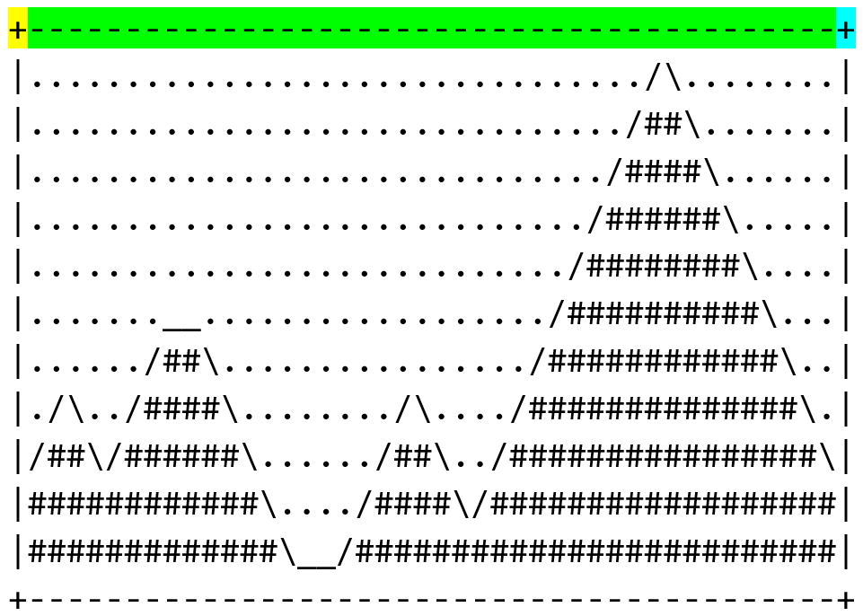
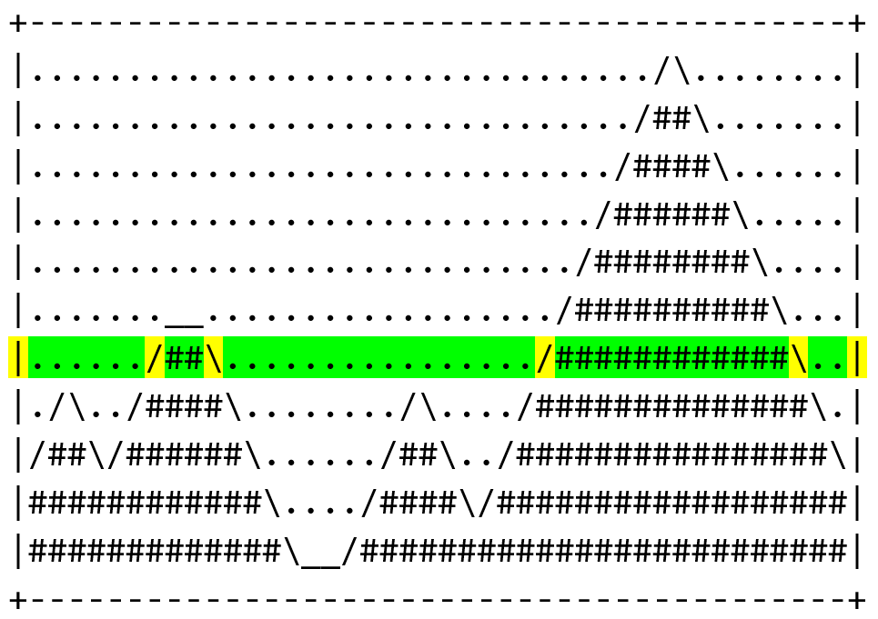

<p align="left">
  <a href="../README.md">
    
  </a>
</p>

<div align="center">
  <h1>
    Mountain Valley ★ (
      <a href="https://drive.google.com/file/d/1p-xaZlGN2hRZrP3F-QhIzJRjoxmsR0aW/view?usp=drive_link">
        <code>00_Intro_03</code>
      </a>
    )
  </h1>
</div>

# Contents (Solution 1)

-   [**การเชื่อมข้อความ**](#การเชื่อมข้อความ)
-   [**การแสดงผลข้อความ**](#การแสดงผลข้อความ)
-   [**Solution 1**](#solution-1)

# Contents (Solution 2)

-   [**Solution 2**](#solution-2)

---

## การเชื่อมข้อความ

ในภาษา Python เราสามารถเชื่อมข้อความด้วยเครื่องหมาย `+` และ `*` ได้

**ตัวอย่างที่ 1:** การเชื่อมข้อความด้วยเครื่องหมาย `+`

การแสดงผลข้อความที่เกิดจากการเชื่อมข้อความ `"A"`, `"B"` และ `"C"` เข้าด้วยกัน
สามารถทำได้โดยการใช้คำสั่งดังกล่าว

**Code**

```python
print("A" + "B" + "C")
```

**Output**

```
ABC
```

**ตัวอย่างที่ 2:** การเชื่อมข้อความด้วยเครื่องหมาย `*`

การแสดงผลข้อความที่เกิดจากการเชื่อมข้อความ `"A"` เข้าด้วยกัน `10` ครั้ง
สามารถทำได้โดยการใช้คำสั่งดังกล่าว

**Code**

```python
print("A" * 10)
```

**Output**

```
AAAAAAAAAA
```

---

## การแสดงผลข้อความ

ในโจทย์ข้อนี้ จะสังเกตเห็นได้ว่าข้อความแต่ละบรรทัดนั้น
เกิดจากการเชื่อมการของสัญลักษณ์

**ตัวอย่างที่ 1**

เมื่อพิจารณาบรรทัดที่ 1 ของภาพ จะพบว่า

-   เริ่มต้นด้วยสัญลักษณ์ `+` จำนวน `1` ตัว
-   ต่อด้วยสัญลักษณ์ `+` จำนวน `42` ตัว
-   จบด้วยสัญลักษณ์ `-` จำนวน `1` ตัว

<p align="center">
  
</p>

เราจะสามารถแสดงผลบรรทัดที่ 1 ของภาพด้วยคำสั่ง ดังนี้

```python
print("+" + ("-" * 42) + "+")
```

**ตัวอย่างที่ 2**

เมื่อพิจารณาบรรทัดที่ 8 ของภาพ จะพบว่า

-   เริ่มต้นด้วยสัญลักษณ์ `|` จำนวน `1` ตัว
-   ต่อด้วยสัญลักษณ์ `.` จำนวน `6` ตัว
-   ต่อด้วยสัญลักษณ์ `/` จำนวน `1` ตัว
-   ต่อด้วยสัญลักษณ์ `#` จำนวน `2` ตัว
-   ต่อด้วยสัญลักษณ์ `\` จำนวน `1` ตัว
-   ต่อด้วยสัญลักษณ์ `.` จำนวน `16` ตัว
-   ต่อด้วยสัญลักษณ์ `/` จำนวน `1` ตัว
-   ต่อด้วยสัญลักษณ์ `#` จำนวน `12` ตัว
-   ต่อด้วยสัญลักษณ์ `\` จำนวน `1` ตัว
-   ต่อด้วยสัญลักษณ์ `.` จำนวน `2` ตัว
-   จบด้วยสัญลักษณ์ `|` จำนวน `1` ตัว

<p align="center">
  
</p>

เราจะสามารถแสดงผลบรรทัดที่ 8 ของภาพด้วยคำสั่ง ดังนี้

```python
print(
    "|"
    + ("." * 6)
    + "/"
    + ("#" * 2)
    + "\\"
    + ("." * 16)
    + "/"
    + ("#" * 12)
    + "\\"
    + ("." * 2)
    + "|"
)
```

> [!NOTE]
>
> เนื่องจากเครื่องหมาย backslash (`\`) เป็นเครื่องหมายพิเศษ ดังนั้นการแสดงผล `\`
> จำนวน 1 ตัว จะใช้คำสั่ง `print("\\")`
>
> สำหรับผู้ที่ต้องการศึกษาเพิ่มเติม [อ่านต่อที่นี่](#เกร็ดความรู้เพิ่มเติม)

---

# Solution 1

เมื่อใช้แนวคิดที่อธิบายไปข้างต้นกับทุกบรรทัดบนภาพ จะได้ code ที่มีลักษณะดังนี้

```python
# --------------------------------------------------
# File Name : 00_Intro_03-sol1.py
# Problem   : Mountain Valley
# Author    : Worralop Srichainont
# Date      : 2025-06-10
# --------------------------------------------------

print("+" + ("-" * 42) + "+")
print("|" + ("." * 32) + "/" + "\\" + ("." * 8) + "|")
print("|" + ("." * 31) + "/" + ("#" * 2) + "\\" + ("." * 7) + "|")
print("|" + ("." * 30) + "/" + ("#" * 4) + "\\" + ("." * 6) + "|")
print("|" + ("." * 29) + "/" + ("#" * 6) + "\\" + ("." * 5) + "|")
print("|" + ("." * 28) + "/" + ("#" * 8) + "\\" + ("." * 4) + "|")
print(
    "|" + ("." * 7) + ("_" * 2) + ("." * 18) + "/" + ("#" * 10) + "\\" + ("." * 3) + "|"
)
print(
    "|"
    + ("." * 6)
    + "/"
    + ("#" * 2)
    + "\\"
    + ("." * 16)
    + "/"
    + ("#" * 12)
    + "\\"
    + ("." * 2)
    + "|"
)
print(
    "|"
    + "."
    + "/"
    + "\\"
    + ("." * 2)
    + "/"
    + ("#" * 4)
    + "\\"
    + ("." * 8)
    + "/"
    + "\\"
    + ("." * 4)
    + "/"
    + ("#" * 14)
    + "\\"
    + "."
    + "|"
)
print(
    "|"
    + "/"
    + ("#" * 2)
    + "\\"
    + "/"
    + ("#" * 6)
    + "\\"
    + ("." * 6)
    + "/"
    + ("#" * 2)
    + "\\"
    + ("." * 2)
    + "/"
    + ("#" * 16)
    + "\\"
    + "|"
)
print(
    "|"
    + ("#" * 12)
    + "\\"
    + ("." * 4)
    + "/"
    + ("#" * 4)
    + "\\"
    + "/"
    + ("#" * 18)
    + "|"
)
print("|" + ("#" * 13) + "\\" + ("_" * 2) + "/" + ("#" * 25) + "|")
print("+" + ("-" * 42) + "+")
```

---

# Solution 2

ในโจทย์ข้อนี้ สามารถพิมพ์ภาพแบบนี้โดยตรงได้เช่นกัน

```python
# --------------------------------------------------
# File Name : 00_Intro_03-sol2.py
# Problem   : Mountain Valley
# Author    : Worralop Srichainont
# Date      : 2025-06-10
# --------------------------------------------------

print("+------------------------------------------+")
print("|................................/\........|")
print("|.............................../##\.......|")
print("|............................../####\......|")
print("|............................./######\.....|")
print("|............................/########\....|")
print("|.......__................../##########\...|")
print("|....../##\................/############\..|")
print("|./\../####\......../\..../##############\.|")
print("|/##\/######\....../##\../################\|")
print("|############\..../####\/##################|")
print("|#############\__/#########################|")
print("+------------------------------------------+")
```

---

## เกร็ดความรู้เพิ่มเติม

**Escape Character** เป็นอักขระพิเศษในภาษา Python โดยที่จะขึ้นต้นด้วย `\`
ซึ่งมีหน้าที่แตกต่างกันไป ดังนี้

-   `\n` หมายถึง การเว้นบรรทัด
-   `\t` หมายถึง การ `tab`
-   `\\` หมายถึง เครื่องหมาย `\` ที่เป็นข้อความธรรมดา
-   `\'` หมายถึง เครื่องหมาย `'` ที่เป็นข้อความธรรมดา
-   `\"` หมายถึง เครื่องหมาย `"` ที่เป็นข้อความธรรมดา

ซึ่งกรณีที่เราอาจต้องการพิมพ์ `\n` เป็นข้อความ ไม่ต้องการให้เว้นบรรทัด
เราจะใช้วิธีการเติม `r` ไปข้างหน้าข้อความ เพื่อบอกกับโปรแกรมว่า
ในข้อความนี้ไม่มี escape character อยู่

**ตัวอย่างที่ 1**

```python
print("Users\new")
```

Output

```
Users
ew
```

**ตัวอย่างที่ 2**

```python
print(r"Users\new")
```

Output

```
Users\new
```

ซึ่งใน Solution 2 ของเรา มีการพิมพ์ backslash (`\`) ต่อด้วยเครื่องหมายอื่น ๆ
จำนวนมาก

ดังนั้นเราสามารถเติม `r` ข้างหน้า เพื่อมั่นใจได้ว่า
โปรแกรมจะไม่มองว่าข้างในข้อความมี escape character ได้

```python
# --------------------------------------------------
# File Name : 00_Intro_03-sol2.py
# Problem   : Mountain Valley
# Author    : Worralop Srichainont
# Date      : 2025-06-10
# --------------------------------------------------

print("+------------------------------------------+")
print(r"|................................/\........|")
print(r"|.............................../##\.......|")
print(r"|............................../####\......|")
print(r"|............................./######\.....|")
print(r"|............................/########\....|")
print(r"|.......__................../##########\...|")
print(r"|....../##\................/############\..|")
print(r"|./\../####\......../\..../##############\.|")
print(r"|/##\/######\....../##\../################\|")
print(r"|############\..../####\/##################|")
print(r"|#############\__/#########################|")
print("+------------------------------------------+")
```

**หมายเหตุ:** ถึงไม่เติม `r` ข้างหน้า ก็ได้ 100 คะแนนเต็ม
