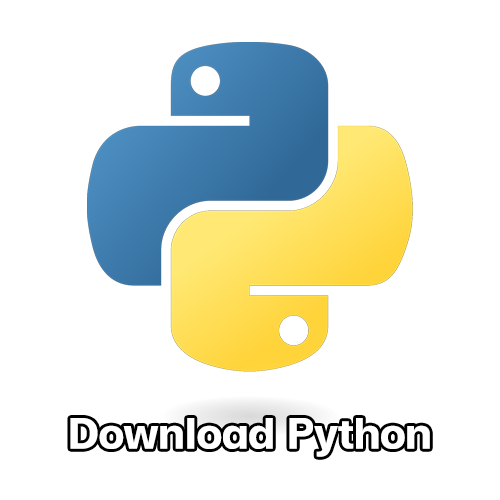
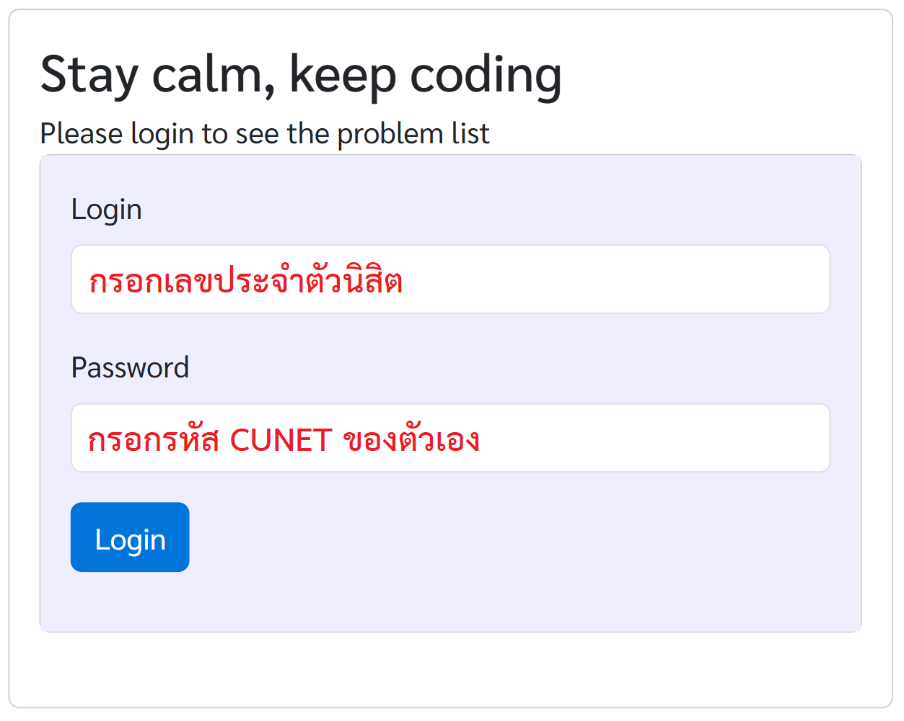

<p align="left">
  <a href="../README.md">
    
  </a>
</p>


# Contents

-   [**ส่วนที่ 1: การติดตั้งโปรแกรม**](#ส่วนที่-1-การติดตั้งโปรแกรม)
-   [**ส่วนที่ 2: การใช้งาน Thonny**](#ส่วนที่-2-การใช้งาน-thonny)
-   [**ส่วนที่ 3: การใช้งาน VS Code**](#ส่วนที่-3-การใช้งาน-vs-code)
-   [**ส่วนที่ 4: การใช้งาน Grader**](#ส่วนที่-4-การใช้งาน-grader)

---

# ส่วนที่ 1: การติดตั้งโปรแกรม

ก่อนที่เราจะมาเริ่มเรียนกัน อย่าลืมติดตั้งโปรแกรมกันก่อนนะครับผม
สามารถกดคลิกที่รูปข้างล่างนี้เพื่อ download โปรแกรมได้เลยครับ

<table align="center" border="0" cellpadding="0" cellspacing="0" style="border-collapse: collapse; width: 95%;">
  <tr style="display: flex; justify-content: center; align-items: center;">
    <td align="center" style="padding-right: 2%;">
      <a href="https://www.python.org/downloads/">
        
      </a>
    </td>
    <td align="center" style="padding-left: 1%; padding-right: 1%;">
      <a href="https://thonny.org/">
        
      </a>
    </td>
    <td align="center" style="padding-left: 2%;">
      <a href="https://code.visualstudio.com/">
        
      </a>
    </td>
  </tr>
</table>

> [!NOTE]
>
> สำหรับโปรแกรม **VS Code** นั้น นิสิตภาควิชาอื่น ๆ <ins>ไม่จำเป็นต้อง
> download</ins> ยกเว้นนิสิตภาควิชาคอมพิวเตอร์ (CP) ที่ต้องใช้งาน
>
> แต่สำหรับผู้ที่สนใจเขียนโปรแกรมในระยะยาว ทางผู้เขียนแนะนำให้ใช้งาน **VS Code**
> เนื่องจากสามารถใช้งานได้หลากหลายมากกว่าโปรแกรม **Thonny** เป็นอย่างมาก

## 1. การติดตั้ง Python

-   เข้า website https://www.python.org/downloads/
-   กด download `Python` เวอร์ชันที่ต้องการ

<p align="center">
  
</p>

-   เมื่อ download เสร็จสิ้น จะพบไฟล์ `.exe` บนเครื่องคอมพิวเตอร์
    ให้กดสองครั้งบนไฟล์นั้นเพื่อติดตั้งโปรแกรม

<p align="center">
  
</p>

-   (Optional) หากต้องการตรวจสอบว่าภาษา `Python` ถูก download
    ลงเครื่องสำเร็จเรียบร้อยแล้ว ให้ลองใช้คำสั่งดังกล่าว ลงบนโปรแกรม
    `Command Prompt`

```bash
python --version
```

<p align="center">
  
</p>
<div align="center"> ตัวอย่างการใช้งานคำสั่ง </div>

## 2. การติดตั้ง Thonny

-   เข้า website https://thonny.org/
-   กด download เวอร์ชันที่เขียนว่า _recommended for you_

<p align="center">
  
</p>

-   เมื่อ download เสร็จสิ้น จะพบไฟล์ `.exe` บนเครื่องคอมพิวเตอร์
    ให้กดสองครั้งบนไฟล์นั้นเพื่อติดตั้งโปรแกรม

<p align="center">
  
</p>

## 3. การติดตั้ง VS Code

-   เข้า website https://code.visualstudio.com/
-   กด download บนหน้า website

<p align="center">
  
</p>

-   เมื่อ download เสร็จสิ้น จะพบไฟล์ `.exe` บนเครื่องคอมพิวเตอร์
    ให้กดสองครั้งบนไฟล์นั้นเพื่อติดตั้งโปรแกรม

---

# ส่วนที่ 2: การใช้งาน Thonny

## 1. ส่วนหลักของโปรแกรม

เมื่อเข้าสู่โปรแกรม จะพบกับหน้าต่างของโปรแกรมของ Thonny ดังภาพ

<p align="center">
  
</p>

ซึ่งจะแบ่งหน้าต่างได้เป็นสองส่วนหลัก ๆ คือ

-   **บริเวณเขียน code** คือบริเวณที่เราจะสร้าง หรือปรับแก้โปรแกรมที่เขียน
-   **บริเวณแสดงผล** คือบริเวณที่แสดงผลลัพธ์
    เมื่อทำการรันโปรแกรมที่เราเขียนไว้ข้างบน

## 2. แถบเมนู

บริเวณแถบมุมซ้ายบน จะเป็นเครื่องมือของโปรแกรม Thonny อยู่บริเวณกรอบสีแดง
ในภาพข้างล่างนี้

<p align="center">
  
</p>

เครื่องมือต่าง ๆ ในกรอบสีแดงเรียงจากซ้ายไปขวา

-   `New` คือเครื่องมือสร้างไฟล์โปรแกรม Python ไฟล์ใหม่
    มีไอคอนเป็นรูปกระดาษสีขาว มีคีย์ลัดคือ `Ctrl + N`
-   `Open` คือเครื่องมือสร้างเปิดไฟล์โปรแกรม Python
    มีไอคอนเป็นรูปแฟ้มเอกสารสีเหลือง มีคีย์ลัดคือ `Ctrl + O`
-   `Save` คือเครื่องมือบันทึกโปรแกรม Python ลงบนเครื่องคอมพิวเตอร์
    มีไอคอนเป็นรูปแผ่น Floppy Disk สีม่วง มีคีย์ลัดคือ `Ctrl + S`
-   `Run` คือเครื่องมือสั่งรันโปรแกรม Python บนไฟล์โปรแกรมที่เปิดอยู่ปัจจุบัน
    มีไอคอนเป็นรูปวงกลมสีเขียว ข้างในมีสามเหลี่ยมสีขาวข้างใน มีคีย์ลัดคือ `F5`
-   `Debug` คือเครื่องมือช่วยเหลือในการตรวจหาข้อผิดพลาดของโปรแกรม Python
    มีไอคอนเป็นรูปแมลงสีเขียว
-   `Stop` คือเครื่องมือสั่งหยุดการรันโปรแกรมแบบฉุกเฉิน ในกรณีที่โปรแกรม Python
    รันแบบไม่รู้จบ มีไอคอนเป็นรูปป้ายสีแดง มีคีย์ลัดคือ `Ctrl + F2`

---

# ส่วนที่ 3: การใช้งาน VS Code

โปรแกรม VS Code (Visual Studio Code) เป็นโปรแกรม text editor เปล่า ๆ
ซึ่งผู้ใช้งานมีหน้าที่ต้องติดตั้ง extension เอง เพื่อให้ VS Code สามารถเขียน
และรันโปรแกรมภาษานั้น ๆ ได้ ต่างจาก Thonny ที่สามารถรันโปรแกรมภาษา Python
ได้เองตั้งแต่ติดตั้งมาอยู่แล้ว

## 1. ติดตั้ง Extension `python`

-   เปิดหน้าจอโปรแกรม VS Code ขึ้นมา
    แล้วคลิกที่ไอคอนที่มีลักษณะเหมือนกับกรอบสีแดง หรือกดคีย์ลัด
    `Ctrl + Shift + X` ก็ได้
-   พิมพ์ค้นหา extension ที่บริเวณกรอบสีเขียวว่า `python`
-   กดเปิด extension อันเดียวกับภาพข้างต้น และกด install

<p align="center">
  
</p>

## 2. การจัดการไฟล์

-   สร้าง folder ที่ต้องการจัดเก็บ code
-   กดไปที่ `File > Open Folder` และเลือก folder นั้น ๆ (คีย์ลัด กด `Ctrl + K`
    จากนั้นกด `Ctrl + O`)

<p align="center">
  
</p>

-   `New File` อยู่ที่บริเวณกรอบสีแดงในภาพข้างล่าง กดเพื่อสร้างไฟล์ใหม่
    (หากสร้างไฟล์ Python อย่าลืมเขียนนามสกุลไฟล์ `.py` ที่ท้ายชื่อด้วย)
-   `New Folder` อยู่ที่บริเวณกรอบสีเขียวในภาพข้างล่าง กดเพื่อสร้างโฟล์เดอร์ใหม่

<p align="center">
  
</p>

-   หากต้องการสร้างไฟล์ในโฟล์เดอร์ ให้กดที่โฟล์เดอร์ที่ต้องการ จากนั้นกด
    `New File`
-   การย้ายไฟล์ และโฟลเดอร์ สามารถทำได้โดยการลากและปล่อยไฟล์บนโปรแกรมได้โดยตรง
-   การลบไฟล์ และโฟลเดอร์ ก็สามารถทำได้โดยการกดปุ่ม `Delete`
    บนโปรแกรมโดยตรงเช่นกัน

## 3. การรันโปรแกรม

การรันโปรแกรมภาษา Python จะกดที่ไอคอนสีแดง และเลือก `Run Python File`

<p align="center">
  
</p>

## 4. ปัญหาที่อาจพบ

การรันโปรแกรม Python ใน VS Code ช่วงแรก ๆ อาจเกิด error ดังภาพ

<p align="center">
  
</p>

ซึ่งที่มาของ error นั้นมาจากได้หลายสาเหตุ แต่โดยส่วนใหญ่แล้ว จะเกิดมาจากการเลือก
version ของ Python ที่ใช้รันโปรแกรมผิด หรือไม่ได้กำหนดไว้

**วิธีแก้ปัญหานี้คือ**

-   เปิด terminal บน VS Code โดยกดปุ่ม `Ctrl + J`
-   ใช้คำสั่งข้างต้นในการตรวจสอบ version ของภาษา Python

```bash
python --version
```

<p align="center">
  
</p>

-   จากภาพพบว่า Python version บน terminal คือ `3.11.8` (เวอร์ชันจะแตกต่างกันไป
    แล้วแต่คน) ดังนั้นเราจะต้องตั้ง version ให้กับ VS Code เป็น `3.11.8`
-   ที่บริเวณแถบข้างบนกลาง ให้ค้นหา `>Python: Select Interpreter`
    และกดคลิกตัวเลือกนั้น ดังภาพ

<p align="center">
  
</p>

-   เลือก version อันเดียวกับที่ขึ้นบน terminal (ในกรณีของผู้เขียน ต้องเลือก
    version `3.11.8`)

<p align="center">
  
</p>

-   จากนั้นลองรันโปรแกรมดูอีกครั้ง พบว่าโปรแกรมสามารถทำงานได้แล้ว

<p align="center">
  
</p>

---

# ส่วนที่ 4: การใช้งาน Grader

## 1. Grader คืออะไร

-   Grader ของรายวิชาเข้าผ่าน website http://2110101.cp.eng.chula.ac.th/
-   Grader จะประกอบไปด้วยโจทย์คอมพิวเตอร์ ซึ่งจะต้องเขียน code เพื่อแก้โจทย์นั้น
    ๆ
-   Grader จะเปิดให้ผู้ใช้งานส่ง code เข้าไป และระบบจะตรวจด้วยกรณีทดสอบ
    (testcases) ว่า code ของทำงานได้ถูกต้อง และครอบคลุมกรณีต่าง ๆ
    ได้มากน้อยแค่ไหน

<p align="center">
  
</p>

## 2. การเข้าใช้งาน Grader

-   เข้า website http://2110101.cp.eng.chula.ac.th/
-   กรอก username เป็นเลขประจำตัวนิสิต และ password เป็นรหัส CUNET ของตนเอง

<p align="center">
  
</p>

> [!IMPORTANT]
>
> ผู้ใช้งานจำเป็นจะต้องลงทะเบียนเรียน และกำลังเรียนรายวิชา 2110101 COMP PROG
> อยู่เท่านั้น จึงจะสามารถใช้งานระบบ Grader ได้

เมื่อเข้าระบบ Grader แล้ว จะพบรายการของโจทย์ต่าง ๆ มากมาย ซึ่งมีองค์ประกอบดังนี้

-   **ชื่อโจทย์** เช่น `Part-III-Text-Formatting`
-   **ไฟล์โจทย์** จะอยู่ตรงปุ่ม `Read` ใต้ชื่อโจทย์
-   **ระดับความยากของโจทย์** สามารถดูได้ที่จำนวนดาว ยิ่งดาวเยอะเท่าไหร่
    แสดงว่าข้อนั้นยิ่งยาก
-   **คะแนน** สามารถดูได้บริเวณที่ไฮไลต์สีแดง
-   **กรณีทดสอบ** สามารถดูได้โดยกดปุ่ม `testcases`
-   **ปุ่มแก้ไข Code** คือปุ่ม `Edit` ซึ่งจะนำไปสู่หน้าที่เราจะใช้ส่ง Code

<p align="center">
  
</p>

เมื่อกดปุ่ม `Edit` ที่หน้าแรกแล้วนั้น จะเข้าสู่หน้าที่เราจะใช้ส่ง Code
แต่ละส่วนบนหน้าจอมีรายละเอียดและวิธีการใช้งานดังนี้

-   **ชื่อโจทย์** เช่น `Part-III-Text-Formatting`
-   **ไฟล์โจทย์** จะอยู่ตรงปุ่ม `Read` ใต้ชื่อโจทย์
-   **คะแนน** สามารถดูได้บริเวณที่ไฮไลต์สีเขียว
-   **ปุ่มยืนยัน** คือปุ่ม `Submit` เมื่อกดแล้วจะทำการส่ง Code
    ไปยังระบบเพื่อตรวจ

สำหรับวิธีการส่ง Code สามารถทำได้ 2 วิธี

-   **วิธีที่ 1** คือการ Copy แล้ว Paste ตัว Code ที่เราเขียนไว้ จากนั้นกด
    `Submit`
-   **วิธีที่ 2** คือการกดปุ่ม `Choose File` แล้วเลือกไฟล์ `Python`
    ที่เราได้เขียนเอาไว้ จากนั้นกด `Submit`
    โดยที่ระบบตรวจให้คะแนนจะเป็นระบบอัตโนมัติ

<p align="center">
  
</p>

## 3. คะแนนบน Grader

เมื่อส่ง code ในโจทย์ปัญหาแล้วนั้น ระบบ Grader จะทำการตรวจโดยอ้างอิงจากกรณีทดสอบ
(testcase) และจะแสดงผลออกมาอยู่ในรูปของคะแนน ตามด้วยตัวอักษร

<p align="center">
  
</p>

จากภาพ มีการแสดงผล `8.3333 [-xxP-x-T-xx-]` ซึ่งหมายความว่าดังนี้

-   code นี้มีคะแนน 8.333 คะแนน จาก 100 คะแนน
-   ในกรณีทดสอบที่ `1` ได้ผลออกมาเป็น `-`
-   ในกรณีทดสอบที่ `2` ได้ผลออกมาเป็น `x`
-   ในกรณีทดสอบที่ `3` ได้ผลออกมาเป็น `x`
-   ในกรณีทดสอบที่ `4` ได้ผลออกมาเป็น `P`
-   ไล่ลำดับกรณีทดสอบเช่นนี้ไปเรื่อย ๆ จนกว่าจะครบ

## 4. ความหมายของสัญลักษณ์

สัญลักษณ์ที่ปรากฎผลคะแนน Grader มีดังนี้

-   `P` หมายถึง code แสดง output บนกรณีทดสอบนั้น ๆ <ins>ถูกต้อง</ins>
-   `-` หมายถึง code แสดง output บนกรณีทดสอบนั้น ๆ <ins>ไม่ถูกต้อง</ins>
-   `x` หมายถึง code เกิด error เมื่อรันบนกรณีทดสอบนั้น ๆ
-   `T` หมายถึง code ใช้เวลารันบนกรณีทดสอบนั้น ๆ เกินเวลาที่กำหนด (1 วินาที)

## 5. วิธีแก้ไขปัญหาเบื้องต้น

เป้าหมายของการทำโจทย์บน Grader เป้าหมายคือการทำให้ได้ 100 คะแนนเต็ม
ซึ่งผู้ที่เพิ่งเริ่มต้นการเขียนโปรแกรม
อาจไม่ใช่เรื่องที่ง่ายเลยในการทำให้ได้คะแนนเต็ม
ในหัวข้อนี้จึงเขียนวิธีการแก้ไขปัญหาเบื้องต้น

-   หลังจากที่ส่งแล้วไม่ได้คะแนนเต็ม ลองพิจารณาคะแนนดูว่าผิดที่กรณีทดสอบ
    (testcase) ไหน

<p align="center">
  
</p>

-   จากตัวอย่างคะแนนข้างบน เราถูกแค่ testcase ที่ 4 เท่านั้น ที่เหลือผิดหมดเลย
-   เปิดหน้า testcase และลองนำกรณีทดสอบนั้น ๆ มารันเองดู
    เพื่อวิเคราะห์ปัญหาเพิ่มเติม

<p align="center">
  
</p>

> [!IMPORTANT]
>
> ในการสอบ Grader จริง <ins><b>ไม่สามารถเปิด testcases ดูได้</b></ins>

## ถ้าหากติด `-` ทำอย่างไรดี

ถ้าติด `-` ต้องไปปรับที่วิธีคิดเลยครับ อาจจะมีบางกรณีที่วิธีคิดของเราผิดพลาดไป

## ถ้าหากติด `x` ทำอย่างไรดี

ถ้าติด `x` แสดงว่าเกิด Error ใน Code ของเรา ซึ่งเกิดได้จากหลายสาเหตุมาก
ในที่นี้จะยกตัวอย่างที่จะพบเจอบ่อยๆ

-   `NameError` มักเกิดจากการที่เราเขียนตัวแปรที่ไม่ได้ประกาศไว้
    หรือเกิดจากการเขียนคำสั่งผิด เช่น

```py
prinT("Hello")
```

-   `IndentationError` เกิดจากการย่อหน้าไม่ถูกต้อง เช่น

```py
if x % 2 == 0:
print("yes")
```

-   `IndexError` เกิดจากการที่เรียกใช้ index ที่ไม่ได้อยู่ในช่วงที่มีค่า เช่น

```py
x = ['A','B','C']
print(x[9999])
```

-   `AttributeError`
    เกิดจากการที่เราเรียกใช้คำสั่งที่ไม่มีอยู่จริงของข้อมูลประเภทนั้น เช่น

```py
x = 1
x.append(2)
```

## ถ้าหากติด `T` ทำอย่างไรดี

ถ้าติด `T` ในวิชานี้ มักจะเกิดจากการที่ Code ติดลูป ไม่ออกจากลูปสักที
ลองแก้ไขการใช้งาน `for loop` และ `while loop` ภายในโค้ดดีๆ

---

# เพิ่มเติม

สำหรับรายละเอียดเกี่ยวกับรายวิชาเพิ่มเติม เทคนิคการเรียน สามารถอ่านได้ที่นี่ครับ

[](https://drive.google.com/file/d/1MobiIMdO5ejGxo801d9RZENZJnBddpBg/view?usp=drive_link)
