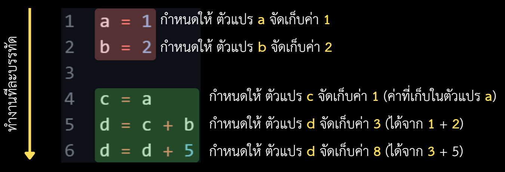
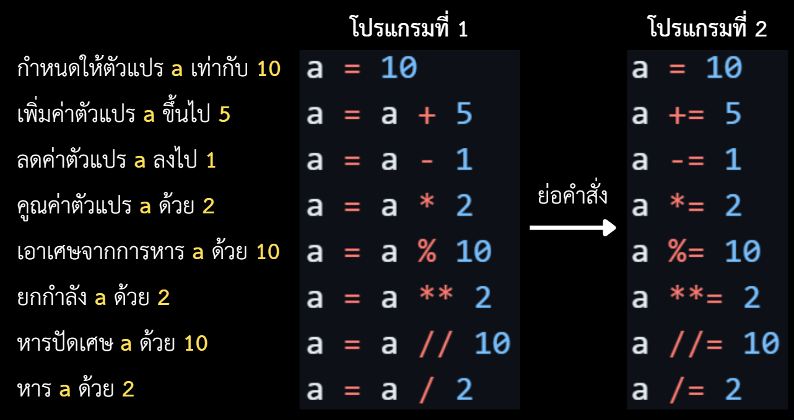

<p align="left">
  <a href="../README.md">
    
  </a>
</p>


# Contents

- [Section 1: Data Types](#section-1-data-types)
    - [1.1. Variables](#11-variables)
    - [1.2. Data Types](#12-data-types)
    - [1.3. Type Conversion](#13-type-conversion)
- [Section 2: Input/Output](#section-2-inputoutput)
    - [2.1. Output](#21-output)
    - [2.2. Input](#22-input)
    - [2.3. Combined Input/Output](#23-combined-inputoutput)
    - [2.4. `f-string`](#24-f-string)
- [Section 3: Arithmetic Operations](#section-3-arithmetic-operations)
    - [3.1. Expressions and Statements](#31-expressions-and-statements)
    - [3.2. Arithmetic Operators](#32-arithmetic-operators)
    - [3.3. Operations Precedence](#33-operations-precedence)
    - [3.4. Augmented Assignments](#34-augmented-assignments)
    - [3.5. String Concatenation and Repetition](#35-string-concatenation-and-repetition)
- [Section 4: Math Module](#section-4-math-module)
    - [4.1. Built-in Functions](#41-built-in-functions)
    - [4.2. Basic Math Functions](#42-basic-math-functions)
    - [4.3. Constants and Angle Conversion](#43-constants-and-angle-conversion)
    - [4.4. Exponential and Logarithm Functions](#44-exponential-and-logarithm-functions)
    - [4.5. Trigonometry Functions](#45-trigonometry-functions)

---

# Section 1: Data Types

ก่อนที่จะเรียนประเภทข้อมูลในภาษา Python เราควรเห็นภาพการทำงานของโปรแกรมก่อน
โดยทั่วไป โปรแกรมจะทำคำสั่งทีละบรรทัดจากบนลงล่าง

```python
x = 10
y = 20
z = x + y
print(z)
print(x)
print(y)
```

ผลลัพธ์คือ

```
30
10
20
```

ในตอนนี้ ผู้อ่านอาจยังไม่รู้ว่า code ดังกล่าวหมายความว่าอย่างไร แต่ในบทเรียนนี้
จะค่อย ๆ พาผู้อ่านทำความเข้าใจทีละประเด็นจนเข้าใจ code ดังกล่าวในที่สุด

---

## 1.1. Variables

**Variables (ตัวแปร)** หมายถึง ที่จัดเก็บข้อมูลในภาษา Python
โดยตัวแปรจะมีชื่อกำกับ และสามารถเปลี่ยนค่าที่จัดเก็บได้

```python
score = 10
score = score + 5
print(score)
```

ผลลัพธ์คือ

```
15
```

<p align="center">
  
</p>

> [!WARNING]
>
> ในภาษา Python การเขียน `1 + 2 = a` ไม่ถูกต้อง เพราะค่าทางซ้ายของ `=`
> ต้องเป็นชื่อที่กำหนดค่าได้ ให้เขียน `a = 1 + 2` แทน

**กฎการตั้งชื่อตัวแปร**

- ใช้ตัวอักษร ตัวเลข หรือขีดเส้นใต้ (`_`) ได้ แต่ห้ามขึ้นต้นด้วยตัวเลข
- ตัวอักษรพิมพ์ใหญ่และพิมพ์เล็กเป็นคนละชื่อกัน
    - เช่น ตัวแปร `score` กับตัวแปร `Score` เป็นคนละตัวแปรกัน
- ห้ามใช้คำสงวน (keyword) ของภาษา Python เป็นชื่อตัวแปร

คำสงวนของภาษา Python มีดังนี้

<table>
  <tr>
    <td><code>False</code></td>
    <td><code>None</code></td>
    <td><code>True</code></td>
    <td><code>and</code></td>
    <td><code>as</code></td>
  </tr>
  <tr>
    <td><code>assert</code></td>
    <td><code>async</code></td>
    <td><code>await</code></td>
    <td><code>break</code></td>
    <td><code>class</code></td>
  </tr>
  <tr>
    <td><code>continue</code></td>
    <td><code>def</code></td>
    <td><code>del</code></td>
    <td><code>elif</code></td>
    <td><code>else</code></td>
  </tr>
  <tr>
    <td><code>except</code></td>
    <td><code>finally</code></td>
    <td><code>for</code></td>
    <td><code>from</code></td>
    <td><code>global</code></td>
  </tr>
  <tr>
    <td><code>if</code></td>
    <td><code>import</code></td>
    <td><code>in</code></td>
    <td><code>is</code></td>
    <td><code>lambda</code></td>
  </tr>
  <tr>
    <td><code>nonlocal</code></td>
    <td><code>not</code></td>
    <td><code>or</code></td>
    <td><code>pass</code></td>
    <td><code>raise</code></td>
  </tr>
  <tr>
    <td><code>return</code></td>
    <td><code>try</code></td>
    <td><code>while</code></td>
    <td><code>with</code></td>
    <td><code>yield</code></td>
  </tr>
</table>

---

## 1.2. Data Types

**Data Types (ประเภทข้อมูล)** บอกว่าค่าหนึ่งมีลักษณะและการใช้งานแบบใด
ตัวอย่างประเภทข้อมูลพื้นฐานใน Python มีดังนี้

**ข้อมูลประเภท `int`** คือจำนวนเต็ม

```python
x = 10
y = -99
z = 0
```

**ข้อมูลประเภท `float`** คือจำนวนจริงที่แสดงจุดทศนิยม

```python
x = 10.0
y = -3.14
z = 0.59184
```

**ข้อมูลประเภท `str`** คือข้อความที่ครอบด้วยเครื่องหมาย `"` หรือ `'`

```python
x = "Hello, World!"
y = 'cheese'
z = "The Faculty of Engineering, Chulalongkorn University."
```

**ข้อมูลประเภท `bool`** คือค่าความจริง มีสองค่า คือ `True` (จริง) และ `False`
(เท็จ)

```python
x = True
y = False
```

**ข้อมูลประเภท `list`** คือรายการข้อมูลที่แก้ไขสมาชิกได้

```python
p = []
q = [1, 2, 3]
r = [1, "apple", 3.14, True]
s = [[1, 2, 3], [4, 5, 6], [7, 8, 9]]
```

**ข้อมูลประเภท `tuple`** คือรายการข้อมูลที่แก้ไขสมาชิก<ins>ไม่ได้</ins>

```python
p = ()
q = (1, 2, 3)
r = (1, "apple", 3.14, True)
s = ((1, 2, 3), (4, 5, 6), (7, 8, 9))
```

**ข้อมูลประเภท `set`** คือรายการข้อมูลที่สมาชิก<ins>ไม่ซ้ำกัน</ins>
และไม่มีลำดับตายตัว

```python
x = set()
y = {1, 2, 3, 4}
z = {"apple", "banana", "orange"}
```

**ข้อมูลประเภท `dict`** คือรายการของคู่ข้อมูล `key` และ `value`

```python
x = {}
y = {"name": "John", "age": 20, "gender": "male"}
```

`None` เป็นค่าพิเศษที่หมายถึง "ไม่มีค่า" และชนิดของค่านี้คือ `NoneType`

```python
x = None
print(type(x))
```

ผลลัพธ์คือ

```
<class 'NoneType'>
```

---

## 1.3. Type Conversion

**Type Conversion (การแปลงประเภทข้อมูล)** คือการแปลงข้อมูลประเภทหนึ่ง
ให้เป็นอีกประเภทหนึ่ง โดยใช้ฟังก์ชัน เช่น `int()` `float()` และ `str()`

**ฟังก์ชัน `int()`** แปลงค่าเป็นจำนวนเต็ม (สำหรับ `float` จะตัดส่วนทศนิยมออก)

```python
a = int(5.8)
b = int(-5.8)
c = int("125")
print(a, b, c)
```

ผลลัพธ์คือ

```
5 -5 125
```

> [!WARNING]
>
> `int("ABCD")` และ `int("3.14")` แปลงไม่ได้ จึงเกิด `ValueError`
> ซึ่งหมายถึงค่าที่ได้รับมีรูปแบบไม่เหมาะกับการแปลงเป็น `int`

**ฟังก์ชัน `float()`** แปลงค่าเป็น `float`

```python
a = float(5)
b = float("-91")
c = float("3.14")
print(a, b, c)
```

ผลลัพธ์คือ

```
5.0 -91.0 3.14
```

> [!WARNING]
>
> `float("ABCD")` แปลงไม่ได้และเกิด `ValueError` เช่นเดียวกัน

**ฟังก์ชัน `str()`** แปลงค่าเป็นข้อความ

```python
a = str(5)
b = str(3.14)
c = str([1, 2, 3])
print(a, b, c)
```

ผลลัพธ์คือ

```
5 3.14 [1, 2, 3]
```

---

# Section 2: Input/Output

- **Input** คือการรับข้อมูลจากผู้ใช้เข้าสู่โปรแกรม
- **Output** คือการแสดงผลข้อมูลจากโปรแกรมออกทางหน้าจอ

## 2.1. Output

**ฟังก์ชัน `print()`** ใช้แสดงผลค่าบนหน้าจอ

```python
print("Hello, World!")
print(12)
print(12.5)
print(True)
print([1, 2, 3])
print({"name": "John", "age": 20})
```

ผลลัพธ์คือ

```
Hello, World!
12
12.5
True
[1, 2, 3]
{'name': 'John', 'age': 20}
```

คำสั่ง `print()` สามารถแสดงผลหลายค่าได้ โดยใช้สัญลักษณ์ `,` คั่นระหว่างค่า

```python
width = 10
height = 20

print("The rectangle width is", width)
print("The rectangle height is", height)
```

ผลลัพธ์คือ

```
The rectangle width is 10
The rectangle height is 20
```

## 2.2. Input

**ฟังก์ชัน `input()`** รับข้อความจากผู้ใช้และคืนค่าเป็น `str` เสมอ

```python
name = input("Enter your name: ")
```

หากผู้ใช้พิมพ์ `John` แล้วกด Enter ตัวแปร `name` จะเก็บค่า `"John"`

ถ้าต้องการจำนวนเต็มหรือจำนวนจริง ให้แปลงข้อความที่รับมา

```python
age = int(input("Enter your age: "))
height = float(input("Enter your height in metres: "))
```

> [!WARNING]
>
> - `int(input())` จะเกิด `ValueError` ถ้าผู้ใช้กรอกข้อความที่ไม่ใช่จำนวนเต็ม
>   เช่น `"ABCD"` หรือ `"10.5"`
> - ส่วน `float(input())` รับ `"10.5"` ได้ แต่ยังเกิด `ValueError`
>   กับข้อความอย่าง `"ABCD"`

## 2.3. Combined Input/Output

ตัวอย่างนี้ใช้ `input()` รับชื่อและอายุ แล้วใช้ `print()` แสดงผล

```python
name = input("Enter your name: ")
age = int(input("Enter your age: "))

print("Hello", name)
print("You are", age, "years old.")
```

เมื่อผู้ใช้กรอก `John` และ `20` หน้าจอจะแสดงผลดังนี้

```
Enter your name: John
Enter your age: 20
Hello John
You are 20 years old.
```

## 2.4. `f-string`

**`f-string`** เป็นเครื่องมือสำหรับแทรกค่าของตัวแปรหรือนิพจน์ลงในข้อความ เขียน
`f` ไว้หน้าเครื่องหมายคำพูด และใส่ตัวแปรหรือนิพจน์ในวงเล็บปีกกา `{}`

```python
name = input("Enter your name: ")
age = int(input("Enter your age: "))

print(f"Hello {name}, you are {age} years old.")
```

เมื่อผู้ใช้กรอก `John` และ `20` ผลลัพธ์คือ

```
Enter your name: John
Enter your age: 20
Hello John, you are 20 years old.
```

---

# Section 3: Arithmetic Operations

**Arithmetic Operations** คือการดำเนินการทางคณิตศาสตร์เบื้องต้นในภาษา Python
เช่น การบวก การลบ การคูณ และการหาร

## 3.1. Expressions and Statements

**Expression (นิพจน์)** คือส่วนของโค้ดที่คำนวณแล้วได้ค่า เช่น `2 + 3` มีค่าเป็น
`5` และ `price * quantity` มีค่าเป็นผลคูณ

**Statement (คำสั่ง)** คือคำสั่งที่ให้โปรแกรมทำงาน เช่น การกำหนดค่าและการพิมพ์ผล
ในโค้ดด้านล่าง `2 + 3` เป็น expression ส่วนทั้งบรรทัด `total = 2 + 3` เป็น
statement

```python
total = 2 + 3
print(total)
```

ผลลัพธ์คือ

```
5
```

## 3.2. Arithmetic Operators

**การบวก (Addition)** ใช้ `+` และ **การลบ (Subtraction)** ใช้ `-`

```python
a = 3 + 2
b = 2 - 3.6
c = 3.25 + 0.109
print(a, b, c)
```

ผลลัพธ์คือ

```
5 -1.6 3.359
```

**การคูณ (Multiplication)** ใช้ `*`

```python
a = 3 * 2
b = 2 * 3.6
c = 3.25 * 0.109
print(a, b, c)
```

ผลลัพธ์คือ

```
6 7.2 0.35425
```

**การหาร (Division)** ใช้ `/` และให้ผลเป็น `float` เสมอ

```python
a = 4 / 2
b = 10 / 4
print(a, b)
```

ผลลัพธ์คือ

```
2.0 2.5
```

**การหารปัดเศษ (Floor Division)** ใช้ `//` โดยการหารโดยปัดเศษทิ้ง
เหลือเพียงแค่คำตอบที่เป็นจำนวนเต็ม

```python
a = 5 // 2
b = 10.0 // 3
c = -10 // 3
print(a, b, c)
```

ผลลัพธ์คือ

```
2 3.0 -4
```

- เมื่อมี `float` อย่าง `10.0 // 3` ผลลัพธ์เป็น `float` ด้วย
- ส่วน `-10 // 3` เป็น `-4` เพราะ `-4` เป็นจำนวนเต็มที่ไม่มากกว่า `-10 / 3`

**เศษจากการหาร (Modulo)** ใช้ `%`

```python
a = 5 % 2
b = 2 % 11
print(a, b)
```

ผลลัพธ์คือ

```
1 2
```

**ยกกำลัง (Power)** ใช้ `**`

```python
a = 5 ** 2
b = 2 ** 3
c = 3.25 ** 2
print(a, b, c)
```

ผลลัพธ์คือ

```
25 8 10.5625
```

## 3.3. Operations Precedence

**Operations Precedence** หมายถึง ลำดับการคำนวณในภาษา Python โดยยึดตามหลักการ
PEMDAS

หลักการ PEMDAS จะเรียงลำดับความสำคัญการดำเนินการทางคณิตศาสตร์ ดังนี้

- **P**arentheses หมายถึง การคำนวณวงเล็บ `()`
- **E**xponential หมายถึง ยกกำลัง `**`
- **M**ultiply หมายถึง การคูณ `*`
- **D**ivide หมายถึง การหาร (`/` และ `//`) และ modulo `%`
- **A**dd หมายถึง การบวก `+`
- **S**ubtract หมายถึง การลบ `-`

> [!IMPORTANT]
>
> - การคูณ และ การหาร มีความสำคัญเท่ากัน
> - การบวก และ การลบ มีความสำคัญเท่ากัน
> - ถ้าหากมีความสำคัญเท่ากัน จะดำเนินการจากซ้ายไปขวา (ยกเว้นการยกกำลัง
>   จะดำเนินการจากขวาไปซ้าย)

**ตัวอย่าง:** การดำเนินการทางคณิตศาสตร์บนภาษา Python

```python
x = 2 * 3 + 8 / -(2 - 4) - 2 ** 2 ** 3
```

**ขั้นตอนที่ 1:** คำนวณในวงเล็บก่อน

```python
x = 2 * 3 + 8 / -(-2) - 2 ** 2 ** 3
```

**ขั้นตอนที่ 2:** คำนวณยกกำลังจากขวาไปซ้าย

```python
x = 2 * 3 + 8 / -(-2) - 2 ** 8
x = 2 * 3 + 8 / -(-2) - 256
```

**ขั้นตอนที่ 3:** เครื่องหมายติดลบ

```python
x = 2 * 3 + 8 / 2 - 256
```

**ขั้นตอนที่ 4:** เครื่องหมายคูณ และเครื่องหมายหาร

```python
x = 6 + 8 / 2 - 256
x = 6 + 4.0 - 256
```

**ขั้นตอนที่ 5:** เครื่องหมายบวก และเครื่องหมายลบ

```python
x = 10.0 - 256
x = -246.0
```

## 3.4. Augmented Assignments

**Augmented Assignments** คือรูปย่อของการคำนวณแล้วกำหนดค่ากลับให้ตัวแปรเดิม เช่น
`a += 5` มีความหมายเดียวกับ `a = a + 5`

```python
a = 10
a += 5
a -= 1
a *= 2
a %= 10
a **= 2
a //= 10
a /= 2
print(a)
```

ผลลัพธ์คือ

```
3.0
```

<p align="center">
  
</p>

## 3.5. String Concatenation and Repetition

เครื่องหมาย `+` และ `*` ยังใช้กับข้อความได้ด้วย `+` เชื่อมข้อความ และ `*`
ทำซ้ำข้อความด้วยจำนวนเต็ม

หากจำนวนครั้งเป็นศูนย์หรือติดลบ ผลลัพธ์จะเป็นข้อความว่าง (`""`)

```python
message = "Hello, " + "World!"
line = "-" * 5
print(message)
print(line)
```

ผลลัพธ์คือ

```
Hello, World!
-----
```

> [!WARNING]
>
> - **การเชื่อมข้อความ:** `"age: " + 20` เกิด `TypeError` ให้แปลงตัวเลขเป็น
>   ข้อความ เช่น `"age: " + str(20)` หรือใช้ `f"age: {20}"`
> - **การทำซ้ำข้อความ:** `"ha" * 2.5` เกิด `TypeError` เพราะตัวคูณต้องเป็น `int`
>   เช่น `"ha" * 2` การแปลง `2.5` เป็น `str` ไม่ช่วยให้ทำซ้ำข้อความได้

---

# Section 4: Math Module

## 4.1. Built-in Functions

Python มี **built-in functions** ที่เรียกใช้ได้ทันที

**ฟังก์ชัน `abs(x)`** หาค่าสัมบูรณ์ของ `x`

```python
a = abs(-5)
b = abs(-2.13)
print(a, b)
```

ผลลัพธ์คือ

```
5 2.13
```

**ฟังก์ชัน `max()`** และ **`min()`**
หาค่ามากที่สุดและน้อยที่สุดจากตัวเลขที่เปรียบเทียบกันได้

```python
largest = max(-99, 81.2, 124.2)
smallest = min([8, 1, -99, 1.02, 99, 124.2])
print(largest, smallest)
```

ผลลัพธ์คือ

```
124.2 -99
```

> [!WARNING]
>
> อย่าส่งข้อมูลคนละชนิดที่เปรียบเทียบกันไม่ได้ เช่น `max(["banana", 82])`
> เพราะจะเกิด `TypeError`

**ฟังก์ชัน `pow(x, y)`** คำนวณ `x` ยกกำลัง `y` เช่นเดียวกับ `x ** y`

```python
a = pow(2, 3)
b = pow(-3, 2)
c = pow(0.5, 3)
print(a, b, c)
```

ผลลัพธ์คือ

```
8 9 0.125
```

**ฟังก์ชัน `round(x, n)`** ปัดเลข `x` ให้มีจำนวนทศนิยม `n` ตำแหน่ง (หากไม่ระบุ
`n` จะปัดเป็นจำนวนเต็มที่ใกล้ที่สุด)

```python
a = round(3.14159265359, 2)
b = round(3.14159265359, 3)
c = round(2.5)
d = round(3.5)
e = round(2, 3)
print(a, b, c, d, e)
```

ผลลัพธ์คือ

```
3.14 3.142 2 4 2
```

- คำสั่ง `round()` คือ ปัดกรณีที่อยู่กึ่งกลาง (`.5`) ไปยังจำนวนคู่ที่ใกล้ที่สุด
  (เช่น `round(2.5)` เป็น `2`)

- คำสั่ง `round()` ไม่ได้บังคับให้แสดงทศนิยมครบ `n` ตำแหน่ง เช่น `round(2, 3)`
  แสดงเป็น `2` ไม่ใช่ `2.000`

**ฟังก์ชัน `sum(numbers)`** หาผลรวมของรายการตัวเลข

```python
a = sum([1, 2, 3])
b = sum([1.7, 2.4, 3.9])
c = sum([1.5, 2, 3.9])
print(a, b, c)
```

ผลลัพธ์คือ

```
6 8.0 7.4
```

## 4.2. Basic Math Functions

สำหรับฟังก์ชันเพิ่มเติมใน **module `math`**
ซึ่งต้องนำเข้าก่อนใช้โดยการใช้คำสั่งดังกล่าว

```python
import math
```

> [!IMPORTANT]
>
> ฟังก์ชันในโมดูลต้องขึ้นต้นด้วย `math.` เช่น `math.sqrt(9)` แต่ built-in เช่น
> `abs(-5)` และ `round(3.14)` ไม่ต้องเขียน `math.`

โมดูล `math` มีคำสั่งพื้นฐานทางคณิตศาสตร์

- `math.sqrt(x)` หารากที่สองของ `x` โดยที่ `x` ต้องไม่ติดลบ
- `math.ceil(x)` ปัดขึ้นเป็นจำนวนเต็มที่ไม่น้อยกว่า `x`
- `math.floor(x)` ปัดลงเป็นจำนวนเต็มที่ไม่มากกว่า `x`
- `math.factorial(n)` หา `n!` โดยที่ `n` ต้องเป็นจำนวนเต็มที่ไม่ติดลบ
- `math.gcd(a, b)` หา ห.ร.ม. ของจำนวนเต็ม
- `math.lcm(a, b)` หา ค.ร.น. ของจำนวนเต็ม

```python
import math

root = math.sqrt(81)
up = math.ceil(3.2)
down = math.floor(3.8)
ways = math.factorial(5)
common_divisor = math.gcd(24, 36)
common_multiple = math.lcm(12, 18)
print(root, up, down, ways, common_divisor, common_multiple)
```

ผลลัพธ์คือ

```
9.0 4 3 120 12 36
```

> [!WARNING]
>
> ค่าที่อยู่นอกโดเมน เช่น `math.sqrt(-1)` หรือ `math.factorial(-1)` จะเกิด
> `ValueError`

## 4.3. Constants and Angle Conversion

โมดูล `math` มีค่าประมาณของค่าคงตัวทางคณิตศาสตร์ และฟังก์ชันแปลงหน่วยมุม

- `math.pi` คือค่าประมาณของ $\pi$
- `math.e` คือค่าประมาณของ Euler's number ($e$)
- `math.degrees(x)` แปลงมุม `x` จากเรเดียนเป็นองศา
- `math.radians(x)` แปลงมุม `x` จากองศาเป็นเรเดียน

```python
import math

angle_radians = math.radians(180)
angle_degrees = math.degrees(math.pi / 2)
print(math.pi)
print(math.e)
print(angle_radians)
print(angle_degrees)
```

ผลลัพธ์คือ

```
3.141592653589793
2.718281828459045
3.141592653589793
90.0
```

## 4.4. Exponential and Logarithm Functions

โมดูล `math` มีคำสั่งที่เกี่ยวกับฟังก์ชัน exponential และฟังก์ชัน logarithm

- `math.exp(x)` คำนวณ $e$ ยกกำลัง `x`
- `math.log(x)` คำนวณลอการิทึมธรรมชาติ หรือ log ฐาน $e$
- `math.log(x, base)` คำนวณ log ฐาน `base` โดยที่ `base` ต้องมากกว่า 0
  และห้ามเท่ากับ 1
- `math.log10(x)` และ `math.log2(x)` คำนวณ log ฐาน 10 และฐาน 2 ตามลำดับ

```python
import math

a = math.exp(1)
b = math.log(math.e)
c = math.log(8, 2)
d = math.log10(1000)
e = math.log2(32)
print(a, b, c, d, e)
```

ผลลัพธ์คือ

```
2.718281828459045 1.0 3.0 3.0 5.0
```

> [!WARNING]
>
> อาร์กิวเมนต์ของฟังก์ชัน log ต้องมากกว่า 0 ดังนั้น `math.log(0)`,
> `math.log(-1)`, `math.log10(0)` และ `math.log2(-2)` เกิด `ValueError`

## 4.5. Trigonometry Functions

โมดูล `math` มีคำสั่งฟังก์ชันตรีโกณมิติ ซึ่งคำสั่งเหล่านี้จะรับและคืนมุมเป็น
**เรเดียน** ไม่ใช่องศา

- `math.sin(x)`, `math.cos(x)` และ `math.tan(x)` รับมุม `x` เป็นเรเดียน
- `math.asin(x)` และ `math.acos(x)` รับได้เฉพาะ `-1 <= x <= 1` และคืนค่าเป็น
  เรเดียน
- `math.atan(x)` คืนค่าเป็นเรเดียนสำหรับจำนวนจริงทุกค่า

```python
import math

angle = math.radians(30)
sine = math.sin(angle)
cosine = math.cos(angle)
tangent = math.tan(angle)
inverse_sine = math.asin(0.5)
inverse_cosine = math.acos(0.5)
inverse_tangent = math.atan(1)
print(round(sine, 6), round(cosine, 6), round(tangent, 6))
print(round(math.degrees(inverse_sine), 6))
print(round(math.degrees(inverse_cosine), 6))
print(round(math.degrees(inverse_tangent), 6))
```

ผลลัพธ์คือ

```
0.5 0.866025 0.57735
30.0
60.0
45.0
```

> [!IMPORTANT]
>
> - หากมีมุมเป็นองศา เช่น `30` ให้ใช้ `math.sin(math.radians(30))` ไม่ใช่
>   `math.sin(30)` โดยตรง
> - ผลลัพธ์ของ `sin`, `cos` และ `tan` เป็นค่าประมาณแบบ floating-point
>   จึงอาจมีทศนิยมคลาดเคลื่อนเล็กน้อย
