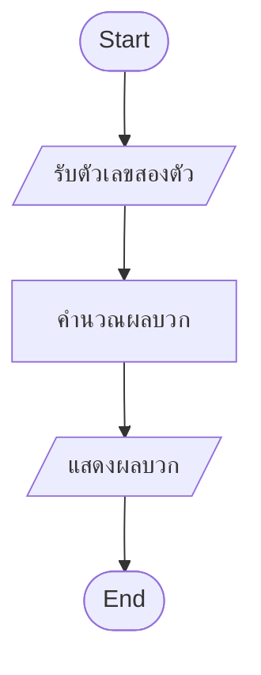
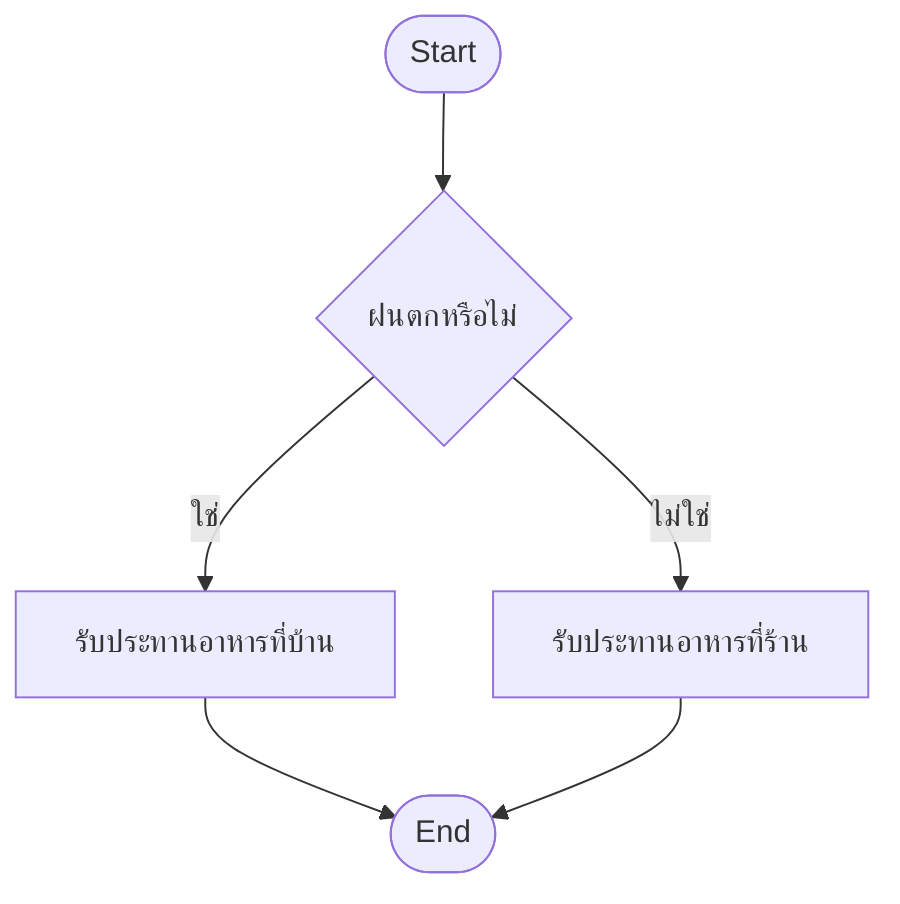

<p align="left">
  <a href="../README.md">
    
  </a>
</p>


# Contents

- [Section 1: Flowchart (แผนผังโปรแกรม)](#section-1-flowchart-แผนผังโปรแกรม)
    - [1.1. Flowchart and Symbols](#11-flowchart-and-symbols)
    - [1.2. Sequence and Selection](#12-sequence-and-selection)
- [Section 2: Selection Statements (คำสั่งการเลือกทำ)](#section-2-selection-statements-คำสั่งการเลือกทำ)
    - [2.1. `if` Statement](#21-if-statement)
    - [2.2. `if-else` Statement](#22-if-else-statement)
    - [2.3. Indentation](#23-indentation)
    - [2.4. `if-elif-else` Statement](#24-if-elif-else-statement)
- [Section 3: Conditions (การเขียนเงื่อนไข)](#section-3-conditions-การเขียนเงื่อนไข)
    - [3.1. Comparison Operators](#31-comparison-operators)
    - [3.2. String Comparison and Membership](#32-string-comparison-and-membership)
    - [3.3. String Methods](#33-string-methods)
    - [3.4. List Comparison and Membership](#34-list-comparison-and-membership)
- [Section 4: Boolean Expressions (นิพจน์บูลลีน)](#section-4-boolean-expressions-นิพจน์บูลลีน)
    - [4.1. `and`, `or`, and `not`](#41-and-or-and-not)
    - [4.2. Ternary Operator](#42-ternary-operator)
    - [4.3. Concise Conditions](#43-concise-conditions)

---

# Section 1: Flowchart (แผนผังโปรแกรม)

**Flowchart (แผนผังโปรแกรม)** คือแผนภาพที่ใช้แสดงลำดับขั้นตอนหรือกระบวนการ
ทำงานอย่างกระชับ แต่ละขั้นตอนใช้สัญลักษณ์ตามหน้าที่ แล้วเชื่อมด้วยลูกศรเพื่อบอก
ทิศทางการทำงาน

ก่อนเขียนโปรแกรม เราสามารถใช้ flowchart วางลำดับการรับข้อมูล การประมวลผล
การตัดสินใจ และการแสดงผลได้ ทำให้เห็นภาพรวมของโปรแกรมก่อนลงมือเขียน code

## 1.1. Flowchart and Symbols

สัญลักษณ์พื้นฐานของ flowchart มีดังนี้

| สัญลักษณ์ | รูปร่าง | ความหมาย |
| :-- | :--: | :-- |
| Terminal | วงรีหรือสี่เหลี่ยมมุมมน | จุดเริ่มต้นและจุดสิ้นสุดของกระบวนการ |
| Process | สี่เหลี่ยมผืนผ้า | การทำงานหรือการประมวลผลหนึ่งขั้นตอน |
| Input/Output | สี่เหลี่ยมด้านขนาน | การรับข้อมูลหรือแสดงผลข้อมูล |
| Decision | สี่เหลี่ยมขนมเปียกปูน | เงื่อนไขสำหรับตัดสินใจเลือกทางทำงาน |
| On-page Connector | วงกลม | เชื่อม flowchart ภายในหน้าเดียวกัน |
| Off-page Connector | รูปห้าเหลี่ยม | เชื่อม flowchart ไปยังหน้าอื่น |

ข้อความใน Decision ต้องเป็นเงื่อนไขที่ตัดสินได้สองทาง เช่น "ใช่/ไม่ใช่" หรือ
`True`/`False` เพื่อให้แต่ละผลลัพธ์นำไปสู่ขั้นตอนที่เหมาะสม

## 1.2. Sequence and Selection

**Sequence (การทำงานตามลำดับ)** คือการทำแต่ละขั้นตอนต่อเนื่องจากบนลงล่าง
โดยไม่มีการแยกทาง เช่น รับตัวเลขสองตัว คำนวณผลบวก แล้วแสดงผล



**Selection (การเลือกทำ)** มี Decision แยกการทำงานตามผลของเงื่อนไข
เมื่อแต่ละทางทำงานเสร็จแล้วจึงกลับมารวมกันและทำขั้นตอนถัดไป



ในภาษา Python สัญลักษณ์ Decision สามารถเขียนเป็นคำสั่ง `if`, `elif` และ
`else` ส่วนคำถามใน Decision เขียนเป็นเงื่อนไขที่ให้ค่า `True` หรือ `False`

---

# Section 2: Selection Statements (คำสั่งการเลือกทำ)

คำสั่งการเลือกทำประกอบด้วยเงื่อนไข และการกระทำที่เลือกตามผลของเงื่อนไข
โปรแกรมจะตรวจสอบเงื่อนไขก่อน แล้วทำเฉพาะชุดคำสั่งของทางที่ถูกเลือก

## 2.1. `if` Statement

คำสั่ง `if` ใช้เมื่อต้องการทำชุดคำสั่งเฉพาะตอนที่เงื่อนไขเป็น `True`
ต้องเขียนเครื่องหมาย colon (`:`) หลังเงื่อนไข และย่อหน้าคำสั่งภายใน `if`

```python
temperature = 32

if temperature >= 30:
    print("Hot weather")
```

ผลลัพธ์คือ

```
Hot weather
```

ถ้า `temperature >= 30` เป็น `False` โปรแกรมจะข้ามคำสั่งที่ย่อหน้าอยู่ภายใน
`if` แล้วทำคำสั่งถัดจาก block นี้

## 2.2. `if-else` Statement

คำสั่ง `if-else` เลือกทำระหว่างสองทาง ถ้าเงื่อนไขเป็น `True` จะทำ block ของ
`if` แต่ถ้าเป็น `False` จะทำ block ของ `else`

```python
age = 16

if age >= 18:
    print("Adult")
else:
    print("Not adult")
```

ผลลัพธ์คือ

```
Not adult
```

โปรแกรมจะทำเพียงหนึ่งในสอง block นี้เสมอ ไม่ทำทั้งสอง block พร้อมกัน

## 2.3. Indentation

**Indentation (การย่อหน้า)** ใช้กำหนดว่าคำสั่งใดอยู่ใน block เดียวกัน
คำสั่งภายใน `if`, `elif` และ `else` ต้องย่อหน้า และคำสั่งที่อยู่ใน block
เดียวกันต้องย่อหน้าเท่ากัน โดยทั่วไปใช้ space 4 ตัวต่อหนึ่งระดับ

```python
number = 7

if number > 0:
    print("Positive")
    print("The condition is true")
else:
    print("Zero or negative")

print("Done")
```

ผลลัพธ์คือ

```
Positive
The condition is true
Done
```

บรรทัด `print("Done")` ไม่ได้ย่อหน้า จึงอยู่นอก `if-else` และทำงานต่อจาก
block ที่ถูกเลือก หากไม่ย่อหน้าหรือย่อหน้าไม่สอดคล้องกัน Python อาจเกิด
`IndentationError`

> [!IMPORTANT]
>
> อย่าลืมเขียน `:` หลังเงื่อนไขของ `if` และ `elif` รวมถึงหลัง `else`
> และรักษาระดับ indentation ของคำสั่งในแต่ละ block ให้ตรงกัน

## 2.4. `if-elif-else` Statement

เมื่อต้องเลือกมากกว่าสองทาง ให้เพิ่ม `elif` ระหว่าง `if` และ `else`
Python จะตรวจสอบเงื่อนไขจากบนลงล่าง และทำเฉพาะ block แรกที่มีเงื่อนไขเป็น
`True` จากนั้นจะข้ามเงื่อนไขที่เหลือ หากทุกเงื่อนไขเป็น `False` จึงทำ block
ของ `else`

```python
light = "yellow"

if light == "green":
    print("Go")
elif light == "yellow":
    print("Slow down")
else:
    print("Stop")
```

ผลลัพธ์คือ

```
Slow down
```

ลำดับของเงื่อนไขจึงมีความสำคัญ โดยเฉพาะเมื่อค่าหนึ่งอาจทำให้หลายเงื่อนไข
เป็นจริงพร้อมกัน

---

# Section 3: Conditions (การเขียนเงื่อนไข)

**Condition (เงื่อนไข)** คือนิพจน์ที่ใช้ตัดสินใจเลือกการทำงาน โดยทั่วไปให้ค่า
เป็นข้อมูลประเภท `bool` คือ `True` หรือ `False`

## 3.1. Comparison Operators

**Comparison (การเปรียบเทียบ)** ใช้ตรวจสอบความสัมพันธ์ระหว่างสองค่า
และคืนค่าเป็น `True` หรือ `False`

| ความหมาย | Operator | ตัวอย่างเมื่อ `num = 10` | ผลลัพธ์ |
| :-- | :--: | :-- | :--: |
| เท่ากับ | `==` | `num == 10` | `True` |
| ไม่เท่ากับ | `!=` | `num != 5` | `True` |
| น้อยกว่า | `<` | `num < 20` | `True` |
| มากกว่า | `>` | `num > 0` | `True` |
| น้อยกว่าหรือเท่ากับ | `<=` | `num <= 10` | `True` |
| มากกว่าหรือเท่ากับ | `>=` | `num >= 5` | `True` |

```python
num = 10
print(num == 10)
print(num != 5)
print(num < 20)
print(num > 0)
print(num <= 10)
print(num >= 5)
```

ผลลัพธ์คือ

```
True
True
True
True
True
True
```

> [!WARNING]
>
> เครื่องหมาย `=` ใช้กำหนดค่าให้ตัวแปร ส่วน `==` ใช้เปรียบเทียบว่าสองค่า
> เท่ากันหรือไม่ จึงทำหน้าที่ต่างกัน

## 3.2. String Comparison and Membership

Python เปรียบเทียบ `str` ทีละตัวจากซ้ายไปขวาตามลำดับ Unicode ของตัวอักษร
คู่แรกที่ต่างกันจะเป็นตัวตัดสินผล หากข้อความหนึ่งเป็นส่วนต้นของอีกข้อความ
ข้อความที่สั้นกว่าจะมีค่าน้อยกว่า

สำหรับอักษรและตัวเลข ASCII ที่ใช้บ่อย ลำดับเป็นตัวเลข อักษรพิมพ์ใหญ่
แล้วจึงอักษรพิมพ์เล็ก เช่น `'0' < '9' < 'A' < 'Z' < 'a' < 'z'`

```python
print("ABC" < "aA")
print("ABC" < "ACAA")
print("ABC" < "ABCC")
print("100" < "19")
```

ผลลัพธ์คือ

```
True
True
True
True
```

ตัวอย่างสุดท้ายเปรียบเทียบข้อความ ไม่ได้เปรียบเทียบค่าตัวเลข จึงพิจารณา
`'0'` กับ `'9'` หลังจากพบว่าอักขระแรกคือ `'1'` เหมือนกัน

คำสั่ง `in` ตรวจสอบว่า `str` ทางซ้ายเป็น substring ของ `str` ทางขวาหรือไม่
และใช้ `not in` เมื่อต้องการตรวจสอบว่าไม่มี substring นั้น

```python
word = "Python"
print("t" in word)
print("Py" in word)
print("hy" in word)
print("z" not in word)
```

ผลลัพธ์คือ

```
True
True
False
True
```

## 3.3. String Methods

String methods ต่อไปนี้ใช้ตรวจสอบลักษณะของข้อความและคืนค่าเป็น `bool`

| Method | คืนค่า `True` เมื่อ |
| :-- | :-- |
| `str.isalpha()` | ข้อความไม่ว่างและทุกตัวเป็นตัวอักษร |
| `str.isdigit()` | ข้อความไม่ว่างและทุกตัวเป็นอักขระตัวเลข |
| `str.isalnum()` | ข้อความไม่ว่างและทุกตัวเป็นตัวอักษรหรือตัวเลข |
| `str.isupper()` | อักษรที่มีตัวพิมพ์ทั้งหมดเป็นตัวพิมพ์ใหญ่ และมีอย่างน้อยหนึ่งตัว |
| `str.islower()` | อักษรที่มีตัวพิมพ์ทั้งหมดเป็นตัวพิมพ์เล็ก และมีอย่างน้อยหนึ่งตัว |

```python
print("Python".isalpha())
print("123".isdigit())
print("Python3".isalnum())
print("PYTHON".isupper())
print("python".islower())
print("ภาษาไทย".isalpha())
```

ผลลัพธ์คือ

```
True
True
True
True
True
True
```

> [!NOTE]
>
> ใน Python 3.11 methods เหล่านี้รองรับอักขระ Unicode ไม่ได้จำกัดเฉพาะ
> ภาษาอังกฤษหรือเลข `0` ถึง `9` เท่านั้น และข้อความว่างจะได้ `False`

## 3.4. List Comparison and Membership

Python เปรียบเทียบ `list` แบบ lexicographic คือเปรียบเทียบสมาชิกตำแหน่งเดียวกัน
จากซ้ายไปขวา สมาชิกคู่แรกที่ต่างกันจะเป็นตัวตัดสิน หากสมาชิกส่วนต้นเหมือนกัน
ทั้งหมด list ที่สั้นกว่าจะมีค่าน้อยกว่า

```python
print([10, 2] > [9, 9, 9])
print([10, 2] > [10, 1, 9])
print([10, 2] > [10])
print([10] > [])
```

ผลลัพธ์คือ

```
True
True
True
True
```

การเปรียบเทียบนี้ไม่ได้นำจำนวนสมาชิกมาเปรียบเทียบก่อน เช่น `[10, 2]`
มากกว่า `[9, 9, 9]` เพราะสมาชิกคู่แรกคือ `10 > 9`

สำหรับ list คำสั่ง `in` ตรวจสอบว่าสิ่งที่อยู่ทางซ้ายเป็นสมาชิกหนึ่งตัวของ list
ไม่ใช่การตรวจสอบ list ย่อย

```python
numbers = [10, 20, 30, 40, 50, 60]
print(30 in numbers)
print(-5 in numbers)
print([10, 20] in numbers)
```

ผลลัพธ์คือ

```
True
False
False
```

ดังนั้นความหมายของ `in` ขึ้นอยู่กับข้อมูลทางขวา เมื่อใช้กับ `str` จะตรวจสอบ
substring แต่เมื่อใช้กับ `list` จะตรวจสอบสมาชิก

---

# Section 4: Boolean Expressions (นิพจน์บูลลีน)

**Boolean Expression (นิพจน์บูลลีน)** คือนิพจน์ที่ให้ค่า `True` หรือ `False`
เมื่อต้องรวมหลายเงื่อนไข สามารถใช้ตัวเชื่อม `and`, `or` และ `not`

## 4.1. `and`, `or`, and `not`

- `and` เป็น `True` เมื่อเงื่อนไขทั้งสองเป็น `True`
- `or` เป็น `True` เมื่ออย่างน้อยหนึ่งเงื่อนไขเป็น `True`
- `not` กลับค่าความจริงจาก `True` เป็น `False` หรือจาก `False` เป็น `True`

| `a` | `b` | `a and b` | `a or b` |
| :--: | :--: | :--: | :--: |
| `True` | `True` | `True` | `True` |
| `True` | `False` | `False` | `True` |
| `False` | `True` | `False` | `True` |
| `False` | `False` | `False` | `False` |

| `a` | `not a` |
| :--: | :--: |
| `True` | `False` |
| `False` | `True` |

```python
age = 20
has_ticket = True

print(age >= 18 and has_ticket)
print(age < 18 or has_ticket)
print(not has_ticket)
```

ผลลัพธ์คือ

```
True
True
False
```

## 4.2. Ternary Operator

**Ternary Operator** หรือ conditional expression ย่อการเลือกค่าด้วย `if-else`
ให้เหลือหนึ่ง expression โดยเขียนในรูป
`value_if_true if condition else value_if_false`

```python
age = 20
customer_type = "Adult" if age >= 18 else "Kids"
print(customer_type)
```

ผลลัพธ์คือ

```
Adult
```

Ternary operator เหมาะกับการเลือกค่าที่สั้นและอ่านง่าย หากแต่ละทางมีหลายคำสั่ง
ควรใช้ `if-else` แบบปกติ

## 4.3. Concise Conditions

Python มีรูปแบบที่ช่วยเขียนเงื่อนไขให้กระชับและสื่อความหมายตรงขึ้น

**ใช้ operator โดยตรง** แทนการครอบด้วย `not`

```python
num = 7
print(num != 5)
print(num not in [5, 10, 15])
```

ผลลัพธ์คือ

```
True
True
```

**เชื่อมการเปรียบเทียบ** เพื่อทดสอบช่วงของค่า

```python
num = 7
print(5 <= num <= 10)
```

ผลลัพธ์คือ

```
True
```

`5 <= num <= 10` สื่อความหมายเดียวกับ `num >= 5 and num <= 10`

**รวมทางเลือกด้วย `in`** แทนการเขียน `or` ซ้ำหลายครั้ง

```python
letter = "e"

if letter in "aeiou":
    print("Vowel")
```

ผลลัพธ์คือ

```
Vowel
```

**กำหนดค่าจากผลการเปรียบเทียบโดยตรง** เพราะ expression เปรียบเทียบให้ค่า
`bool` อยู่แล้ว

```python
a = 3
b = 8
is_lower = a < b
print(is_lower)
```

ผลลัพธ์คือ

```
True
```

เมื่อกลับเงื่อนไขที่เชื่อมด้วย `and` หรือ `or` สามารถกระจาย `not`
ตามกฎของ De Morgan ได้ เช่น `not (a or b)` เท่ากับ
`not a and not b` และ `not (a and b)` เท่ากับ `not a or not b`
