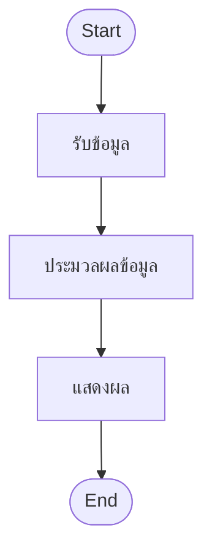
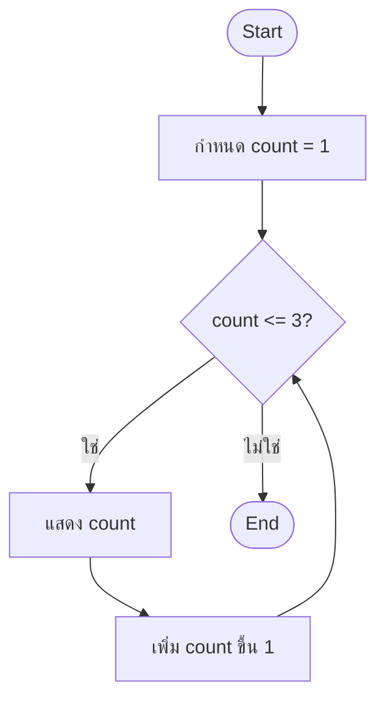

<p align="left">
  <a href="../README.md">
    
  </a>
</p>


# Contents

- [Section 1: Flowchart](#section-1-flowchart)
    - [1.1. Meaning of Flowchart](#11-meaning-of-flowchart)
    - [1.2. Flowchart Symbols](#12-flowchart-symbols)
    - [1.3. Decision and Repetition](#13-decision-and-repetition)
- [Section 2: While Loop](#section-2-while-loop)
    - [2.1. How a While Loop Works](#21-how-a-while-loop-works)
    - [2.2. While Loop Syntax](#22-while-loop-syntax)
    - [2.3. Indentation](#23-indentation)
- [Section 3: For Loop](#section-3-for-loop)
    - [3.1. Forms of For Loop](#31-forms-of-for-loop)
    - [3.2. For Loop Using Range](#32-for-loop-using-range)
    - [3.3. For Loop Using String and List](#33-for-loop-using-string-and-list)
    - [3.4. `enumerate()`](#34-enumerate)
- [Section 4: Loop Control](#section-4-loop-control)
    - [4.1. Infinite Loop](#41-infinite-loop)
    - [4.2. `break`](#42-break)
    - [4.3. `continue`](#43-continue)

---

# Section 1: Flowchart

## 1.1. Meaning of Flowchart

**Flowchart (แผนผังงาน)** คือแผนภาพที่ใช้แสดงลำดับขั้นตอนหรือกระบวนการทำงาน
ให้กระชับและเข้าใจง่าย แต่ละขั้นตอนใช้สัญลักษณ์ตามหน้าที่ และใช้ลูกศรบอกทิศทาง
การทำงานจากจุดเริ่มต้นไปยังจุดสิ้นสุด

Flowchart ช่วยให้มองเห็นโครงสร้างของโปรแกรมก่อนลงมือเขียน code เช่น
ขั้นตอนใดทำงานตามลำดับ ขั้นตอนใดต้องตัดสินใจ และขั้นตอนใดต้องย้อนกลับมาทำซ้ำ



## 1.2. Flowchart Symbols

สัญลักษณ์พื้นฐานที่ใช้ใน Flowchart มีดังนี้

| สัญลักษณ์ | รูปร่าง | ความหมาย |
|---|---|---|
| Terminal | สี่เหลี่ยมมุมมน | จุดเริ่มต้นหรือจุดสิ้นสุดของกระบวนการ |
| Process | สี่เหลี่ยมผืนผ้า | การทำงานในแต่ละขั้นตอน |
| Input/Output | สี่เหลี่ยมด้านขนาน | การรับข้อมูลหรือแสดงผลข้อมูล |
| Decision | สี่เหลี่ยมข้าวหลามตัด | เงื่อนไขสำหรับตัดสินใจเลือกทางทำงาน |
| On-page Connector | วงกลม | เชื่อมส่วนของ Flowchart ในหน้าเดียวกัน |
| Off-page Connector | รูปห้าเหลี่ยม | เชื่อม Flowchart ไปยังหน้าถัดไป |

Decision ควรเป็นคำถามที่ตอบได้สองทาง เช่น **ใช่** หรือ **ไม่ใช่** แล้วแต่ละคำตอบ
จะนำไปสู่ขั้นตอนที่ต่างกัน

## 1.3. Decision and Repetition

Flowchart แบบตัดสินใจจะแยกเส้นทางตามผลของเงื่อนไข และรวมกลับไปยังขั้นตอนถัดไป
ได้ ส่วน Flowchart แบบทำซ้ำจะมีอย่างน้อยหนึ่งเส้นทางย้อนกลับไปตรวจสอบเงื่อนไขเดิม



แผนผังนี้ตรวจสอบเงื่อนไขก่อนทำงานทุกครั้ง หากเงื่อนไขเป็นจริง โปรแกรมจะแสดงค่า
และเปลี่ยน `count` ก่อนย้อนกลับไปตรวจสอบใหม่ เมื่อเงื่อนไขเป็นเท็จจึงออกจากการทำซ้ำ

---

# Section 2: While Loop

## 2.1. How a While Loop Works

**While Loop** คือการทำซ้ำด้วยคำสั่ง `while` โดยมีเงื่อนไขกำหนดว่าจะทำซ้ำต่อหรือไม่
จึงเหมาะกับงานที่ยังระบุจำนวนครั้งล่วงหน้าไม่ได้แน่นอน

ลำดับการทำงานของ `while` คือ

1. ตรวจสอบเงื่อนไข
2. หากเงื่อนไขเป็น `True` ให้ทำคำสั่งภายใน loop แล้วกลับไปตรวจสอบเงื่อนไขใหม่
3. หากเงื่อนไขเป็น `False` ให้ข้ามคำสั่งภายใน loop และทำคำสั่งถัดจาก loop

เพราะตรวจสอบเงื่อนไขก่อน หากเงื่อนไขเป็น `False` ตั้งแต่ครั้งแรก คำสั่งภายใน
`while` จะไม่ทำงานเลย

## 2.2. While Loop Syntax

รูปแบบของ `while` คือ

```python
while condition:
    do_if_true()

do_if_false()
```

- `condition` คือเงื่อนไขที่ตรวจสอบก่อนเริ่มการทำซ้ำแต่ละครั้ง
- เครื่องหมาย colon (`:`) ต้องอยู่ต่อท้ายเงื่อนไข
- คำสั่งที่ย่อหน้าใต้ `while` จะทำงานเมื่อเงื่อนไขเป็นจริง
- คำสั่งที่เลิกย่อหน้าจะทำงานต่อเมื่อออกจาก loop แล้ว

ตัวอย่างต่อไปนี้แสดงค่า `count` ตั้งแต่ `1` ถึง `3`

```python
count = 1

while count <= 3:
    print(count)
    count += 1

print("Done")
```

ผลลัพธ์คือ

```
1
2
3
Done
```

คำสั่ง `count += 1` ทำให้เงื่อนไขเปลี่ยนไปในแต่ละรอบ เมื่อ `count` เป็น `4`
เงื่อนไข `count <= 3` จึงเป็นเท็จและ loop หยุดทำงาน

> [!IMPORTANT]
>
> ควรตรวจสอบว่าค่าที่เกี่ยวข้องกับเงื่อนไขมีโอกาสเปลี่ยนจนเงื่อนไขเป็น `False`
> มิฉะนั้น loop อาจทำงานซ้ำโดยไม่สิ้นสุด

## 2.3. Indentation

**Indentation (การย่อหน้า)** ใช้กำหนดว่าคำสั่งใดอยู่ภายใน `while` คำสั่งภายใน
loop เดียวกันต้องย่อหน้าอยู่ในระดับเดียวกัน

```python
number = 1

while number < 4:
    print(number)
    number += 1

print("Finished")
```

ผลลัพธ์คือ

```
1
2
3
Finished
```

ในตัวอย่างนี้ `print(number)` และ `number += 1` อยู่ภายใน loop ส่วน
`print("Finished")` เลิกย่อหน้าแล้ว จึงทำงานเพียงครั้งเดียวหลังจบ loop

> [!WARNING]
>
> หากคำสั่งแรกหลัง `while` ไม่ย่อหน้า หรือคำสั่งใน block เดียวกันย่อหน้าไม่ตรงกัน
> Python จะเกิด `IndentationError`

---

# Section 3: For Loop

## 3.1. Forms of For Loop

**For Loop** คือการทำซ้ำด้วยคำสั่ง `for` มักใช้เมื่อระบุจำนวนครั้งได้แน่นอน
หรือเมื่อต้องการนำสมาชิกจากข้อมูลมาใช้ทีละค่า

ในบทนี้มีการใช้ `for` สามแบบ

| รูปแบบ | ค่าที่ตัวแปรได้รับในแต่ละรอบ |
|---|---|
| `for i in range(...):` | ตัวเลขในช่วงที่ `range()` กำหนด |
| `for char in text:` | ตัวอักษรแต่ละตัวจากข้อความ |
| `for item in items:` | สมาชิกแต่ละตัวจากลิสต์ |

ชื่อตัวแปร `i`, `char` และ `item` เป็นเพียงชื่อที่สื่อความหมาย สามารถเปลี่ยนเป็น
ชื่ออื่นได้ โดยตัวแปรจะได้รับค่าถัดไปเมื่อเริ่มรอบใหม่

## 3.2. For Loop Using Range

**For Loop Using Range** ใช้ `for` ร่วมกับ `range()` เพื่อทำซ้ำตามช่วงจำนวนเต็ม
โดยเขียนได้สามรูปแบบ

| รูปแบบ | ค่าเริ่มต้น | ค่าหยุด | ระยะก้าว |
|---|---:|---:|---:|
| `range(stop)` | `0` | ไม่รวม `stop` | `1` |
| `range(start, stop)` | `start` | ไม่รวม `stop` | `1` |
| `range(start, stop, step)` | `start` | ไม่รวม `stop` | `step` |

- `start` คือจำนวนเต็มตัวแรกของช่วง
- `stop` คือขอบเขตที่ไม่ถูกรวมอยู่ในช่วง และเป็นค่าที่ต้องระบุเสมอ
- `step` คือระยะที่ค่าเปลี่ยนไปในแต่ละรอบ หากไม่ระบุจะเป็น `1`

ตัวอย่าง `range(2, 7)` ให้ค่า `2`, `3`, `4`, `5` และ `6` ตามลำดับ

```python
for number in range(2, 7):
    print(number, end=" ")
```

ผลลัพธ์คือ

```
2 3 4 5 6
```

เมื่อ `step` เป็นจำนวนเต็มบวก ค่าจะเพิ่มขึ้น ส่วน `step` เป็นจำนวนเต็มลบ
ค่าจะลดลง

```python
for number in range(0, 10, 3):
    print(number, end=" ")

print()

for number in range(8, -1, -2):
    print(number, end=" ")
```

ผลลัพธ์คือ

```
0 3 6 9
8 6 4 2 0
```

> [!WARNING]
>
> `step` เป็น `0` ไม่ได้ เช่น `range(0, 10, 0)` จะเกิด `ValueError`

## 3.3. For Loop Using String and List

เมื่อใช้ `for` กับ **string** ตัวแปรใน loop จะได้รับตัวอักษรทีละตัวตามลำดับ

```python
text = "Loop"

for char in text:
    print(char.upper())
```

ผลลัพธ์คือ

```
L
O
O
P
```

เมื่อใช้ `for` กับ **list** ตัวแปรใน loop จะได้รับสมาชิกทีละตัว ตัวอย่างต่อไปนี้
สะสมผลรวมของสมาชิกในลิสต์

```python
total = 0

for item in [3, 5, 2]:
    total += item
    print(total)
```

ผลลัพธ์คือ

```
3
8
10
```

จำนวนรอบของสองตัวอย่างนี้เท่ากับจำนวนตัวอักษรใน string และจำนวนสมาชิกใน list
ตามลำดับ

## 3.4. `enumerate()`

ฟังก์ชัน **`enumerate()`** ใช้เมื่อต้องการทั้งลำดับ (**index**) และค่า
(**value**) ในแต่ละรอบ โดยใช้ได้กับ string, list และ tuple

```python
items = [15, 1, -9]

for index, item in enumerate(items):
    print(f"At index {index}, the value is {item}")
```

ผลลัพธ์คือ

```
At index 0, the value is 15
At index 1, the value is 1
At index 2, the value is -9
```

ในแต่ละรอบ `index` เป็นลำดับซึ่งเริ่มจาก `0` ส่วน `item` เป็นค่าจากลิสต์
ตำแหน่งนั้น

---

# Section 4: Loop Control

## 4.1. Infinite Loop

**Infinite Loop** คือ loop ที่ทำงานซ้ำโดยไม่สิ้นสุด อาจตั้งใจเขียนด้วย
`while True` หรือเกิดจาก logic ที่ไม่ทำให้เงื่อนไขเปลี่ยนเป็นเท็จ

```python
while True:
    print("Infinite Loop")
```

code นี้พิมพ์ข้อความต่อไปเรื่อย ๆ เพราะเงื่อนไข `True` ไม่มีวันเป็นเท็จ
จึงไม่ควรรันโดยไม่มีวิธีหยุด loop

ตัวอย่างต่อไปนี้ไม่เป็น Infinite Loop เพราะ `number` เปลี่ยนค่าในแต่ละรอบ

```python
number = 3

while number < 10:
    print(number)
    number += 3

print("Done")
```

ผลลัพธ์คือ

```
3
6
9
Done
```

## 4.2. `break`

คำสั่ง **`break`** หยุด loop ที่กำลังทำงานทันที แล้วโปรแกรมทำคำสั่งถัดจาก
loop ต่อ

```python
for number in range(1, 6):
    if number == 3:
        break
    print(f"Current number: {number}")

print("Stopped")
```

ผลลัพธ์คือ

```
Current number: 1
Current number: 2
Stopped
```

เมื่อ `number` เป็น `3` โปรแกรมพบ `break` ก่อนคำสั่ง `print()` ภายใน loop
จึงไม่แสดง `3` และไม่เริ่มรอบถัดไป

`break` ใช้ร่วมกับ `while True` เพื่อหยุด loop เมื่อถึงเงื่อนไขที่ต้องการได้
ตัวอย่างนี้รับจำนวนเต็มจนกว่าผู้ใช้จะกรอกค่าที่ไม่น้อยกว่า `10`

```python
while True:
    number = int(input("Number: "))
    if number >= 10:
        break
    print("Try again.")

print("Done")
```

เมื่อผู้ใช้กรอก `4`, `8` และ `12` ตามลำดับ ผลลัพธ์คือ

```
Number: 4
Try again.
Number: 8
Try again.
Number: 12
Done
```

> [!IMPORTANT]
>
> เงื่อนไขสำหรับ `break` ต้องสอดคล้องกับเป้าหมาย ในตัวอย่างนี้ต้องใช้
> `number >= 10` เพราะต้องหยุดเมื่อค่า **ไม่น้อยกว่า** `10`

## 4.3. `continue`

คำสั่ง **`continue`** ข้ามคำสั่งส่วนที่เหลือของรอบปัจจุบัน แล้วเริ่มรอบถัดไป
ทันที โดยไม่ได้หยุด loop ทั้งหมด

```python
for number in range(1, 6):
    if number == 3:
        continue
    print(f"Current number: {number}")
```

ผลลัพธ์คือ

```
Current number: 1
Current number: 2
Current number: 4
Current number: 5
```

เมื่อ `number` เป็น `3` โปรแกรมพบ `continue` จึงข้าม `print()` เฉพาะรอบนั้น
จากนั้น loop ยังทำงานต่อด้วย `number` เท่ากับ `4` และ `5`

| คำสั่ง | ผลต่อการทำซ้ำ |
|---|---|
| `break` | หยุด loop ทั้งหมดทันที |
| `continue` | ข้ามส่วนที่เหลือของรอบปัจจุบัน แล้วทำรอบถัดไป |
