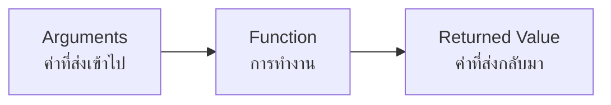

<p align="left">
  <a href="../README.md">
    
  </a>
</p>


# Contents

- [Section 1: Usage of Function](#section-1-usage-of-function)
    - [1.1. What Is a Function?](#11-what-is-a-function)
    - [1.2. Built-in and User-Defined Functions](#12-built-in-and-user-defined-functions)
- [Section 2: Function Creation](#section-2-function-creation)
    - [2.1. Function Syntax and Call](#21-function-syntax-and-call)
    - [2.2. Parameters and Arguments](#22-parameters-and-arguments)
    - [2.3. Variable Scope](#23-variable-scope)
    - [2.4. Parameter Usage](#24-parameter-usage)
    - [2.5. `return` and `print`](#25-return-and-print)
- [Section 3: Best Practices](#section-3-best-practices)
    - [3.1. Function Properties](#31-function-properties)
    - [3.2. Docstrings](#32-docstrings)
    - [3.3. Type Hints](#33-type-hints)

---

# Section 1: Usage of Function

## 1.1. What Is a Function?

**Function (ฟังก์ชัน)** คือกลุ่มของ code สำหรับทำงานอย่างใดอย่างหนึ่ง โดย code
ภายใน function จะทำงานเมื่อ function ถูกเรียกใช้เท่านั้น

Function ช่วยแบ่งโปรแกรมออกเป็นส่วนย่อย ๆ ที่มีหน้าที่ชัดเจน และมีคุณสมบัติสำคัญ
ดังนี้

- **Reusable:** เขียนครั้งเดียวแล้วเรียกใช้ซ้ำได้
- **Specific Task:** แต่ละ function มักรับผิดชอบงานหนึ่งอย่างโดยเฉพาะ
- **Modular:** แยกส่วนการทำงานออกจาก code หลัก

ตัวอย่างเช่น หากต้องคำนวณราคาหลังหักส่วนลดหลายครั้ง การแยกสูตรไว้ใน function
ทำให้ชื่อ function สื่อความหมายของการคำนวณ และไม่ต้องเขียนสูตรเดิมซ้ำ

```python
def discounted_price(price, discount):
    return price - discount


first_price = discounted_price(120, 20)
second_price = discounted_price(85, 5)
print(first_price, second_price)
```

ผลลัพธ์คือ

```
100 80
```

หากต้องแก้สูตร เราสามารถแก้ที่ function เพียงแห่งเดียว การเรียกใช้ทุกตำแหน่งก็จะ
ใช้สูตรใหม่ทันที จึงช่วยให้ code อ่านง่าย ใช้ซ้ำง่าย และแก้ไขข้อผิดพลาดง่ายขึ้น

## 1.2. Built-in and User-Defined Functions

Function ในบทนี้แบ่งเป็นสองกลุ่ม

| ประเภท | ความหมาย | ตัวอย่าง |
| --- | --- | --- |
| **Built-in Function** | Function ที่ Python เตรียมไว้ให้แล้ว | `print()`, `input()`, `len()`, `round()` |
| **User-Defined Function** | Function ที่ผู้เขียนโปรแกรมสร้างขึ้นเอง | `discounted_price()` |

Built-in function สามารถเรียกใช้ได้ทันที เช่น `len()` ใช้หาจำนวนสมาชิก

```python
items = [10, 20, 30, 40]
print(len(items))
```

ผลลัพธ์คือ

```
4
```

ส่วน user-defined function ต้องสร้างด้วย `def` ก่อน แล้วจึงเรียกใช้ด้วยชื่อที่เรา
กำหนด รายละเอียดจะอธิบายในส่วนถัดไป

---

# Section 2: Function Creation

การทำงานของ function ประกอบด้วยข้อมูลสามส่วน



Function บางตัวอาจไม่รับ argument หรืออาจไม่ได้เขียน `return` ก็ได้

## 2.1. Function Syntax and Call

ใช้คำสั่ง `def` ตามด้วยชื่อ function วงเล็บสำหรับ parameters และเครื่องหมาย
colon (`:`) เพื่อสร้าง function คำสั่งภายใน function ต้องเยื้องให้ถูกต้อง

```python
def add(a, b):
    result = a + b
    return result
```

ในตัวอย่างนี้ code เป็นเพียงการ **define function** หรือระบุว่า function ทำงาน
อย่างไร การ define ยังไม่ทำให้คำสั่งใน function ทำงาน

**Function Call (การเรียกใช้ฟังก์ชัน)** เขียนชื่อ function ตามด้วยวงเล็บ และใส่
argument ที่ต้องการส่งเข้าไป

```python
def add(a, b):
    result = a + b
    return result


output = add(5, 3)
print(output)
```

ผลลัพธ์คือ

```
8
```

เมื่อเรียก `add(5, 3)` โปรแกรมจะส่ง `5` และ `3` เข้าไป ทำคำสั่งภายใน function
แล้วนำค่าที่ `return` ออกมาเก็บในตัวแปร `output`

> [!IMPORTANT]
>
> อย่าลืมเครื่องหมาย `:` ต่อท้ายบรรทัด `def` และเยื้องคำสั่งทุกบรรทัดภายใน
> function ให้อยู่ในระดับเดียวกัน

## 2.2. Parameters and Arguments

- **Parameter** คือตัวแปรใน definition ของ function ซึ่งใช้รับค่า
- **Argument** คือค่าที่ส่งให้ function ในขณะที่เรียกใช้

```python
def subtract(a, b):
    return a - b


print(subtract(10, 4))
```

ใน code นี้ `a` และ `b` คือ parameters ส่วน `10` และ `4` คือ arguments

### Positional Arguments

**Positional Argument** จับคู่ argument กับ parameter ตามลำดับ การสลับลำดับ
arguments จึงอาจทำให้ผลลัพธ์เปลี่ยนไป

```python
def subtract(a, b):
    return a - b


print(subtract(10, 4))
print(subtract(4, 10))
```

ผลลัพธ์คือ

```
6
-6
```

ในการเรียกครั้งแรก `a` รับค่า `10` และ `b` รับค่า `4` ส่วนครั้งที่สอง `a`
รับค่า `4` และ `b` รับค่า `10`

### Keyword Arguments

**Keyword Argument** ระบุชื่อ parameter พร้อมค่าที่ต้องการส่งให้ จึงเรียงลำดับ
ต่างจาก definition ได้

```python
def subtract(a, b):
    return a - b


print(subtract(b=4, a=10))
```

ผลลัพธ์คือ

```
6
```

### Default Parameters

**Default Parameter** คือ parameter ที่กำหนดค่าเริ่มต้นไว้ หากผู้เรียกไม่ส่ง
argument มาให้ parameter นั้น function จะใช้ default value

```python
def print_hello(name="User"):
    print(f"Hello, {name}!")


print_hello("Alice")
print_hello()
```

ผลลัพธ์คือ

```
Hello, Alice!
Hello, User!
```

การเรียกครั้งแรกส่ง argument ให้ `name` จึงใช้ค่า `"Alice"` ส่วนครั้งที่สองไม่ได้
ส่ง argument จึงใช้ default value คือ `"User"`

## 2.3. Variable Scope

**Scope (ขอบเขต)** ระบุตำแหน่งที่สามารถใช้ตัวแปรหนึ่งได้

### Local Variable

**Local Variable** คือตัวแปรที่ประกาศภายใน function และใช้ได้ภายใน function
นั้นเท่านั้น

```python
def show_secret():
    secret = 100
    print(secret)


show_secret()
```

ผลลัพธ์คือ

```
100
```

หากเขียน `print(secret)` นอก function จะเกิด `NameError` เพราะชื่อนี้อยู่นอก
scope ที่ใช้งานได้

### Global Variable

**Global Variable** คือตัวแปรที่ประกาศภายนอก function ตัวแปรนี้สามารถนำมาอ่าน
ได้ทั้งภายในและภายนอก function

```python
name = "John"


def print_hello():
    print(f"Hello, {name}")


print_hello()
print(name)
```

ผลลัพธ์คือ

```
Hello, John
John
```

### Shadowing Variable

**Shadowing Variable** เกิดเมื่อ local variable และ global variable ใช้ชื่อเดียวกัน
แต่ทั้งสองเป็นคนละตัวแปร

```python
name = "John"


def print_hello():
    name = "Alice"
    print(f"Hello, {name}")


print_hello()
print(name)
```

ผลลัพธ์คือ

```
Hello, Alice
John
```

ภายใน `print_hello()` ชื่อ `name` หมายถึง local variable ที่มีค่า `"Alice"`
ส่วนภายนอก function ชื่อเดียวกันยังหมายถึง global variable ที่มีค่า `"John"`

> [!WARNING]
>
> การใช้ชื่อ local variable ซ้ำกับ global variable อาจทำให้สับสนว่าแต่ละบรรทัด
> กำลังใช้ตัวแปรใด

## 2.4. Parameter Usage

Parameter สามารถนำไปคำนวณหรือแสดงผลภายใน function ได้ เช่น `a` และ `b`
ถูกนำมาบวกกันในตัวอย่างก่อนหน้า และ `name` ถูกแทรกลงในข้อความ

เมื่อส่ง argument ให้ function ตัว parameter จะอ้างถึง object เดียวกับค่าที่ส่งเข้าไป
ผลที่เห็นภายนอก function จึงขึ้นอยู่กับว่า code **กำหนดค่าใหม่ให้ parameter** หรือ
**แก้ไข object เดิม**

### Rebinding a Parameter

การกำหนดค่าใหม่ให้ parameter ทำให้ชื่อนั้นอ้างถึง object ใหม่ภายใน function
แต่ไม่เปลี่ยนตัวแปรที่ส่งเข้ามา ตัวอย่างนี้ใช้ `int` ซึ่งแก้ไขค่าภายใน object เดิม
ไม่ได้

```python
def modify_number(num):
    num = num + 10
    print("Inside:", num)


x = 10
modify_number(x)
print("Outside:", x)
```

ผลลัพธ์คือ

```
Inside: 20
Outside: 10
```

หลักเดียวกันนี้ใช้กับ `float`, `str`, `tuple` และ `bool` ซึ่งเป็นข้อมูลที่แก้ไข
ค่าภายใน object เดิมไม่ได้

### Mutating an Object

ข้อมูลอย่าง `list`, `set` และ `dict` แก้ไขสมาชิกภายใน object เดิมได้ หาก function
ทำเช่นนั้น ตัวแปรภายนอกที่อ้างถึง object เดียวกันจะเห็นการเปลี่ยนแปลงด้วย

```python
def add_item(nums):
    nums.append(4)
    print("Inside:", nums)


my_list = [1, 2, 3]
add_item(my_list)
print("Outside:", my_list)
```

ผลลัพธ์คือ

```
Inside: [1, 2, 3, 4]
Outside: [1, 2, 3, 4]
```

ในตัวอย่างนี้ `append()` แก้ไข list เดิม ไม่ได้กำหนด list ใหม่ให้ parameter

## 2.5. `return` and `print`

คำสั่ง `return` คืนค่าจาก function ไปยังตำแหน่งที่เรียกใช้ และจบการทำงานของ
function ทันที

```python
def add(a, b):
    return a + b


result = add(5, 3)
print("Result:", result)
```

ผลลัพธ์คือ

```
Result: 8
```

คำสั่งหลัง `return` ในเส้นทางการทำงานเดียวกันจะไม่ถูกรัน

```python
def add(a, b):
    return a + b
    print("This line is not executed")
```

`print()` ต่างจาก `return` เพราะ `print()` มีหน้าที่แสดงผลบนหน้าจอ ไม่ได้ส่ง
ค่าที่แสดงกลับไปให้ผู้เรียก หาก function ทำงานจนจบโดยไม่มี `return` Python จะคืน
ค่า `None`

```python
def show_sum(a, b):
    print(a + b)


result = show_sum(5, 3)
print("Result:", result)
```

ผลลัพธ์คือ

```
8
Result: None
```

หากต้องการนำผลลัพธ์ไปเก็บในตัวแปรหรือคำนวณต่อ ให้ใช้ `return` หากต้องการแสดง
ข้อมูลบนหน้าจอ ให้ใช้ `print()`

---

# Section 3: Best Practices

## 3.1. Function Properties

Function ที่ดีควรมีหน้าที่ชัดเจน แยกออกจาก code หลัก และเรียกใช้ซ้ำได้

- **Reusable:** ไม่ผูกติดกับการเรียกใช้เพียงครั้งเดียว
- **Specific Task:** ทำหน้าที่หลักเพียงอย่างเดียว
- **Modular:** แยกส่วนการทำงานออกจากส่วนอื่นของโปรแกรม

คุณสมบัติเหล่านี้ทำให้ผู้อ่านเข้าใจจุดประสงค์จากชื่อ function และแก้ไขส่วนการทำงาน
ได้โดยไม่ต้องไล่แก้ code ที่เรียกใช้ทุกตำแหน่ง

## 3.2. Docstrings

**Docstring** คือข้อความบรรยาย function ซึ่งเขียนด้วย triple quotes (`"""`)
เป็นคำสั่งแรกภายใน function โดยควรอธิบายว่า function ทำอะไร รับ arguments แบบใด
และคืนค่าอะไร

```python
def get_distance(point_01, point_02):
    """Calculate the Euclidean distance between two points.

    Args:
        point_01 (tuple): The (x, y) coordinates of the first point.
        point_02 (tuple): The (x, y) coordinates of the second point.

    Returns:
        float: The Euclidean distance between the two points.
    """
    x1, y1 = point_01
    x2, y2 = point_02
    return ((x1 - x2) ** 2 + (y1 - y2) ** 2) ** 0.5
```

บรรทัดแรกสรุปหน้าที่ของ function ส่วน `Args` และ `Returns` อธิบายข้อมูลที่รับ
และค่าที่คืนตามลำดับ

## 3.3. Type Hints

**Type Hints** ใช้ระบุประเภทของ parameters และ returned value เขียนประเภทของ
parameter หลัง `:` และเขียนประเภทของ returned value หลัง `->`

```python
def get_distance(
    point_01: tuple[float, float],
    point_02: tuple[float, float],
) -> float:
    """Calculate the Euclidean distance between two points."""
    x1, y1 = point_01
    x2, y2 = point_02
    return ((x1 - x2) ** 2 + (y1 - y2) ** 2) ** 0.5
```

ในตัวอย่างนี้ `point_01` และ `point_02` เป็น tuple ที่ประกอบด้วย `float` สองค่า
ส่วน `-> float` ระบุว่า function คืนค่าเป็น `float`
