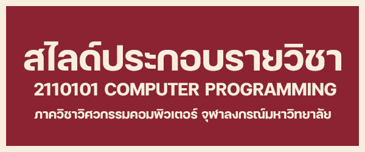

# 2110101 COMPUTER PROGRAMMING


[](/PL-Problem-List/)

# About this Repository

-   Repository นี้สร้างขึ้นเพื่อจัดเก็บ code ของผู้เขียน
    และเอกสารการเรียนการสอนในรายวิชา **2110101 COMPUTER PROGRAMMING (เทอม
    2/2566)**
-   Repository นี้สร้างขึ้นโดยมีจุดประสงค์คือ การสร้างแหล่งรวบรวม resources ต่าง
    ๆ ของรายวิชา **2110101 COMPUTER PROGRAMMING** ไว้ในที่เดียว
    เพื่อนิสิตคณะวิศวกรรมศาสตร์ จุฬาลงกรณ์มหาวิทยาลัย
-   Repository นี้เหมาะสำหรับนิสิตคณะวิศวกรรมศาสตร์ จุฬาลงกรณ์มหาวิทยาลัย
    และผู้ที่สนใจในการเขียนโปรแกรมภาษา Python
-   Repository นี้สร้างโดย **นายวรลภย์ ศรีชัยนนท์**

```python
class ThisRepo:
    def __init__(self):
        self.version = '2.0.0'
        self.last_updated = '05 June 2025'
```

---

# Study Guide


[](https://drive.google.com/file/d/1MobiIMdO5ejGxo801d9RZENZJnBddpBg/view?usp=drive_link)

---

# Resources


<table align="center" border="0" cellpadding="0" cellspacing="0" style="border-collapse: collapse; width: 95%;">
  <tr style="display: flex; justify-content: center; align-items: center;">
    <td align="center" style="padding-right: 2%;">
      <a href="https://www.python.org/downloads/">
        
      </a>
    </td>
    <td align="center" style="padding-left: 1%; padding-right: 1%;">
      <a href="https://thonny.org/">
        
      </a>
    </td>
    <td align="center" style="padding-left: 2%;">
      <a href="https://code.visualstudio.com/">
        
      </a>
    </td>
  </tr>
</table>

<table align="center" border="0" cellpadding="0" cellspacing="0" style="border-collapse: collapse; width: 95%;">
  <tr style="display: flex; justify-content: center; align-items: center;">
    <td align="center" style="padding-right: 2.5%;">
      <a href="/SM-Study-Materials/02-COM-PROG-Slides/00-COM-PROG-All-Slides.pdf">
        
      </a>
    </td>
    <td align="center" style="padding-left: 2.5%;">
      <a href="https://www.cp.eng.chula.ac.th/~somchai/python101/">
        
      </a>
    </td>
  </tr>
</table>

[](/SM-Study-Materials/)

---


